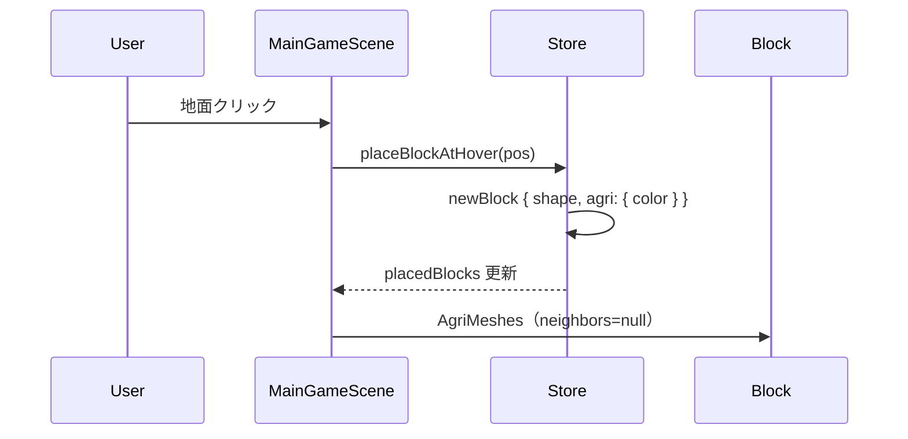
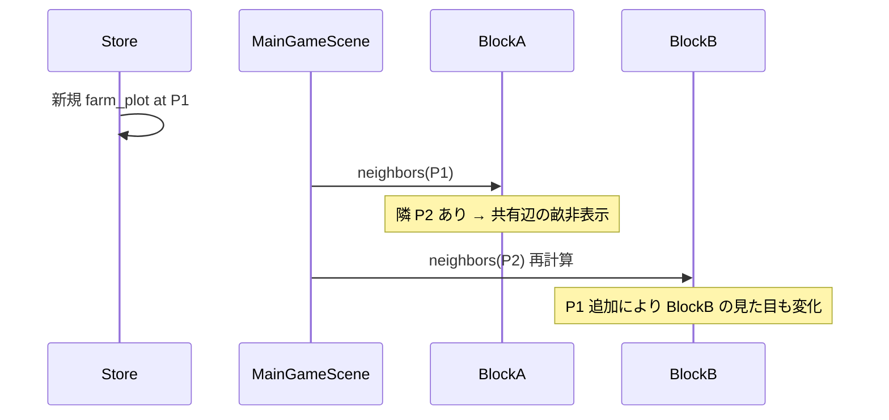
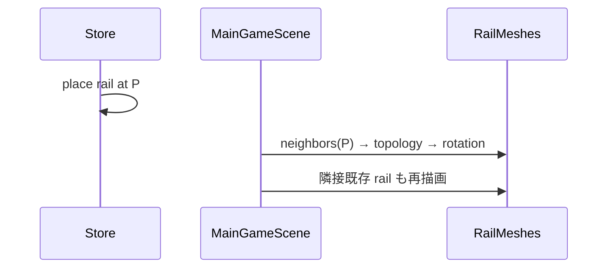

# 農地・線路 — 詳細設計書（Phase 3-A/B + 線路隣接）

## 文書情報

| 項目 | 内容 |
|------|------|
| 関連文書 | `04_農地実装計画_A-B.md`（計画・スコープ） |
| 対象 | 農地 Phase 3-A/B、線路隣接リファクタ（並行推奨） |
| 結論 | **隣接判定は共通モジュール化し、農地と線路を同時並行で入れることを推奨** |

---

## 0. エグゼクティブサマリー

### 線路も並行でやるべきか？

**はい。Bフェーズのタイミングで並行投入を推奨する。**

| 観点 | 農地のみ | 農地 + 線路 並行 |
|------|----------|------------------|
| 隣接ロジック | `agriNeighbors.js` が農地専用になる | `gridNeighbors.js` 1本で再利用 |
| MainGameScene | 農地だけ特別扱い | 「隣接が要るブロック」に統一 prop |
| 線路の見た目 | 今のまま（マスごとに独立） | 直線・分岐がつながる（まちづくり体験↑） |
| 追加工数 | Bのみ | **+0.5〜1日**（共通基盤あり） |
| リスク | 後から線路対応で agri 専用を壊す | 初手から API が安定 |

**推奨スプリント構成**

```
Sprint 1 … 3-A（農地タイル・パレット・保存）— 隣接なし
Sprint 2 … 共通隣接基盤 + 3-B 農地 + 線路 B（並行）
```

---

## 1. 現状分析

### 1.1 線路（`Block.jsx` → `renderRail`）

現状の1マス線路は**常に同じローカル構造**：

- 枕木 3本：Z = -0.18, 0, 0.18（**東西方向に横断**）
- レール 2本：X = ±0.12 の円柱、**Z 軸方向に伸びる**（実質「南北走行」用）
- 親 `group` の `rotation`（`blockRotation`）で向きは変えられるが、**隣マスとは無関係**
- 隣に線路を並べても、枕木・レールがマスごとに重複し「バラバラな線路」に見える

```text
現状（2マス横並び）:

  [枕木|枕木|枕木] [枕木|枕木|枕木]
  [レール    レール] [レール    レール]  ← 境界で二重
```

### 1.2 農地（未実装）

計画どおり `farm_plot` / `rice_paddy` は **辺の共有** で畝・畦を抑える。  
線路と同じく **カーディナル4方向のトポロジ** が核になる。

### 1.3 共通点

| 項目 | 農地 | 線路 |
|------|------|------|
| グリッド | 0.5m | 0.5m |
| 隣接方向 | ±X, ±Z | ±X, ±Z |
| 同一形状のみ接続 | `farm_plot`↔`farm_plot` | `rail`↔`rail` |
| 表現の違い | 辺の有無（畝・畦） | トポロジ（直線・曲線・分岐） |
| Y層 | 床面付近（≈0.25） | 床面付近（path 同様） |

→ **隣接探索は100%共通化可能**。

---

## 2. 共通アーキテクチャ

### 2.1 モジュール構成

```text
src/
├── utils/
│   └── gridNeighbors.js          # 共通：カーディナル隣接
├── constants/
│   └── agriData.js
├── components/3d/
│   ├── agri/
│   │   ├── AgriMeshes.jsx
│   │   └── agriColliders.jsx
│   └── transport/                  # 新規（線路抽出）
│       ├── index.js
│       ├── RailMeshes.jsx          # renderRail から移管
│       └── railTopology.js         # トポロジ → 見た目
```

`Block.jsx` の責務：

- `isAgriShape` → `AgriMeshes`
- `shape === 'rail'` → `RailMeshes`（隣接 prop 付き）
- それ以外は既存どおり

### 2.2 共通 API：`gridNeighbors.js`

#### 2.2.1 定数

```javascript
export const CARDINAL = ['plusX', 'minusX', 'plusZ', 'minusZ'];

export const CARDINAL_DELTA = {
  plusX:  [ 0.5, 0, 0],
  minusX: [-0.5, 0, 0],
  plusZ:  [0, 0,  0.5],
  minusZ: [0, 0, -0.5],
};

export const DEFAULT_NEIGHBOR_OPTS = {
  posEpsilon: 0.05,   // XY/Z 位置一致
  yTolerance: 0.10,   // 同一層
  matchShape: true,   // shape 完全一致
  matchMaterial: false,
};
```

#### 2.2.2 型（JSDoc）

```javascript
/**
 * @typedef {'plusX'|'minusX'|'plusZ'|'minusZ'} CardinalDir
 * @typedef {Record<CardinalDir, boolean>} CardinalNeighbors
 */

/**
 * @param {{ pos: number[], shape: string, material?: string }} block
 * @param {Array} placedBlocks
 * @param {{ matchShape?: boolean, matchMaterial?: boolean, shapeFilter?: string }} opts
 * @returns {CardinalNeighbors}
 */
export function getCardinalNeighbors(block, placedBlocks, opts = {}) { … }
```

#### 2.2.3 アルゴリズム（疑似コード）

```text
FOR each dir in CARDINAL:
  target = block.pos + CARDINAL_DELTA[dir]
  neighbors[dir] = placedBlocks.some(other =>
    other.id !== block.id
    AND (NOT matchShape OR other.shape === block.shape)
    AND |other.pos[i] - target[i]| < posEpsilon for i in 0..2
    AND |other.pos[1] - block.pos[1]| < yTolerance
  )
RETURN neighbors
```

#### 2.2.4 パフォーマンス（現状規模）

- 素朴実装：O(N) per block、描画時 N 回 → O(N²)
- `placedBlocks` が数百程度なら問題なし
- **将来**：`Map<"x,y,z", blockId>` を `MainGameScene` で1回構築し O(1) 参照

```javascript
// 将来用（Sprint 2 では optional）
export function buildPosIndex(placedBlocks, gridStep = 0.5) {
  const key = (p) => `${Math.round(p[0]/gridStep)},${Math.round(p[1]/gridStep)},${Math.round(p[2]/gridStep)}`;
  …
}
```

### 2.3 MainGameScene：隣接の注入パターン

**方針**：配置ループ内で都度計算（シンプル優先）。

```javascript
const CONNECTABLE_SHAPES = new Set([
  'farm_plot', 'rice_paddy', 'rail'
]);

placedBlocks.map(block => {
  const neighbors = CONNECTABLE_SHAPES.has(block.shape)
    ? getCardinalNeighbors(block, placedBlocks)
    : null;

  return (
    <Block
      key={block.id}
      …
      agri={block.agri}
      agriNeighbors={isAgriShape(block.shape) ? neighbors : undefined}
      railNeighbors={block.shape === 'rail' ? neighbors : undefined}
    />
  );
});
```

ゴーストプレビュー（線路・農地）：

```javascript
const ghostNeighbors = hoverPosition && selectedShape
  ? getCardinalNeighbors(
      { pos: hoverPosition, shape: selectedShape },
      placedBlocks
    )
  : null;
```

---

## 3. 農地 — 詳細設計（Phase 3-A）

### 3.1 `agriData.js`（完全定義）

```javascript
export const AGRI_SHAPES = ['farm_plot', 'rice_paddy', 'garden_bed'];
export const AGRI_CONNECTABLE_SHAPES = ['farm_plot', 'rice_paddy']; // B 対象
export const AGRI_COLORABLE_SHAPES = AGRI_SHAPES;

export const DEFAULT_AGRI_COLORS = {
  farm_plot:  '#8d6e63',
  rice_paddy: '#4fc3f7',
  garden_bed: '#a1887f',
};

export const AGRI_META = { … }; // 04 計画書と同様
```

### 3.2 `AgriMeshes` コンポーネント I/F

```typescript
// 概念インターフェース
type AgriMeshesProps = {
  position: [number, number, number];
  shape: 'farm_plot' | 'rice_paddy' | 'garden_bed';
  rotation?: number;          // 度。農地は基本 0 固定でも可
  scale?: [number, number, number];
  isGhost?: boolean;
  agri?: { color?: string };
  agriNeighbors?: CardinalNeighbors | null;  // B 以降
  // ホバー・編集・イベント（PlantMeshes と同型）
};
```

### 3.3 メッシュ座標系（ローカル）

原点：ブロック中心。Y=0 は立方体標準面（上面 +0.25）。

| 形状 | 基準 Y | 備考 |
|------|--------|------|
| 土台/水面 | -0.24 | `path` と揃える |
| 畝/畦 | -0.22 〜 -0.20 | 土台より +0.02 |

### 3.4 `farm_plot` — 単体メッシュ（A）

```text
        +Z
         ↑
    ┌─────────┐
    │ 畝(Z)   │
    │ ┌─────┐ │
    │ │ 土  │ │
    │ └─────┘ │
    └─────────┘
  畝(X): 左右に細い box
```

| メッシュ | args (w,h,d) | position | material |
|----------|--------------|----------|----------|
| soil | 0.5, 0.02, 0.5 | [0, -0.24, 0] | `agri.color` |
| furrowX_L | 0.02, 0.03, 0.5 | [-0.22, -0.22, 0] | darken(soil, 0.85) |
| furrowX_R | 0.02, 0.03, 0.5 | [0.22, -0.22, 0] | 同上 |
| furrowZ_F | 0.5, 0.03, 0.02 | [0, -0.22, 0.22] | 同上 |
| furrowZ_B | 0.5, 0.03, 0.02 | [0, -0.22, -0.22] | 同上 |

**A では4本すべて描画**。B で隣接辺に応じて抑制。

### 3.5 `farm_plot` — 隣接抑制（B）

| 辺 | `neighbors` | 非表示にする畝 |
|----|-------------|----------------|
| +X | `plusX: true` | furrowX_R（自マスの東側＝隣の西側と重複） |
| -X | `minusX: true` | furrowX_L |
| +Z | `plusZ: true` | furrowZ_F |
| -Z | `minusZ: true` | furrowZ_B |

**共有辺の Z-fighting 対策**：残す畝の幅を 0.02、抑制側は描画しない（0.001 オフセットは不要）。

### 3.6 `rice_paddy` — 単体（A）

| メッシュ | args | position | 備考 |
|----------|------|----------|------|
| water | 0.42, 0.015, 0.42 | [0, -0.235, 0] | transparent 0.85 |
| bund_N | 0.5, 0.03, 0.04 | [0, -0.22, 0.23] | 北畦（+Z） |
| bund_S | 0.5, 0.03, 0.04 | [0, -0.22, -0.23] | 南畦 |
| bund_E | 0.04, 0.03, 0.42 | [0.23, -0.22, 0] | 東畦 |
| bund_W | 0.04, 0.03, 0.42 | [-0.23, -0.22, 0] | 西畦 |

土色 `#6d4c41` 固定、水色は `agri.color`。

### 3.7 `rice_paddy` — 隣接（B）

**描画権ルール**（重複防止）：

```text
辺 E (+X) を描画する条件:
  NOT neighbors.plusX
  OR (neighbors.plusX AND block.id < neighbor.id)  // タイブレーク

実装簡略版（ライト）:
  neighbors.plusX === true → 自マスの bund_E を非表示
  （隣マスが bund_W を描画する対称設計）
```

| 辺 | 隣接あり | 自マスで描画する畦 |
|----|----------|-------------------|
| +X | yes | bund_E を非表示（隣の bund_W に任せる） |
| -X | yes | bund_W 非表示 |
| +Z | yes | bund_N 非表示 |
| -Z | yes | bund_S 非表示 |

**角の閉じ**：2辺以上隣接時も、外周のみ残すルールで角柱1個は不要（ライト）。

### 3.8 `garden_bed`（A のみ、B 非接続）

| パーツ | args | position |
|--------|------|----------|
| frame | 0.5, 0.06, 0.5 | [0, -0.22, 0] |
| soil | 0.40, 0.02, 0.40 | [0, -0.24, 0] |

### 3.9 コライダー（`agriColliders.jsx`）

```javascript
export function getAgriCollider(shape, scale = [1,1,1]) {
  const sy = scale[1] ?? 1;
  switch (shape) {
    case 'farm_plot':
    case 'rice_paddy':
    case 'garden_bed':
      return <CuboidCollider args={[0.25, 0.01*sy, 0.25]} position={[0, -0.24, 0]} />;
  }
}
```

### 3.10 Store 拡張

```javascript
// 初期状態
selectedAgriColors: { ...DEFAULT_AGRI_COLORS },

setSelectedAgriColor: (shape, color) => set(state => ({
  selectedAgriColors: { ...state.selectedAgriColors, [shape]: color }
})),

// setSelectedShape 内
if (isAgriShape(shape)) {
  patch.selectedScale = [...AGRI_META[shape].defaultScale];
  patch.selectedMaterial = AGRI_META[shape].defaultMaterial;
}

// placeBlockAtHover
const agriPayload = isAgriShape(selectedShape) ? {
  color: get().selectedAgriColors[selectedShape] ?? DEFAULT_AGRI_COLORS[selectedShape]
} : undefined;
// newBlock.agri = agriPayload
```

**セーブ互換**：`agri` 未定義 → `DEFAULT_AGRI_COLORS[shape]`。

---

## 4. 線路 — 詳細設計（隣接リファクタ）

### 4.1 目標

- 直線区間：枕木がマス境界で二重にならない
- 分岐：T字・十字を**見た目だけ**表現（データは1マス1 `rail` のまま）
- 既存の `blockRotation`（Rキー）との関係を定義

### 4.2 トポロジ分類 `railTopology.js`

入力：`CardinalNeighbors`（同一 `rail` のみ）

```javascript
export const RAIL_TOPOLOGY = {
  ISOLATED: 'isolated',     // 0000
  END: 'end',               // 0001 など1方向のみ
  STRAIGHT_NS: 'straight_ns', // +Z/-Z のみ（南北直線）
  STRAIGHT_EW: 'straight_ew', // +X/-X のみ
  CORNER_NE: 'corner_ne',   // +X,+Z（例）
  T_N: 't_n',               // 3方向
  CROSS: 'cross',           // 4方向
};
```

#### 4.2.1 判定表

| plusX | minusX | plusZ | minusZ | topology | 推奨 rotation (度) |
|-------|--------|-------|--------|----------|-------------------|
| 0 | 0 | 0 | 0 | ISOLATED | 0（デフォルト NS） |
| 1 | 0 | 0 | 0 | END | 90（東向き終端） |
| 1 | 1 | 0 | 0 | STRAIGHT_EW | 90 |
| 0 | 0 | 1 | 1 | STRAIGHT_NS | 0 |
| 1 | 0 | 1 | 0 | CORNER_* | 個別マップ |
| 1 | 1 | 1 | 0 | T_* | 個別 |
| 1 | 1 | 1 | 1 | CROSS | 0 |

```javascript
export function getRailTopology(neighbors) {
  const mask =
    (neighbors.plusX ? 8 : 0) |
    (neighbors.minusX ? 4 : 0) |
    (neighbors.plusZ ? 2 : 0) |
    (neighbors.minusZ ? 1 : 0);
  return TOPOLOGY_TABLE[mask] ?? 'isolated';
}

export function getRailRotationForTopology(topology) {
  return ROTATION_TABLE[topology] ?? 0;
}
```

### 4.3 `RailMeshes` 描画戦略（B ライト）

#### 方針 A（推奨）：トポロジ別パーツ切替

| topology | 枕木 | レール |
|----------|------|--------|
| STRAIGHT_NS | Z方向に3本（現状維持） | X=±0.12、Z方向円柱 |
| STRAIGHT_EW | X方向に3本 | Z=±0.12、X方向円柱 |
| END | 終端側に枕木1本強調、他は省略可 | 1方向のみ伸ばす |
| CORNER | L字配置の枕木2方向 | 2方向にレール曲げ（円柱2本で近似） |
| CROSS | 十字枕木 | 4方向レール短円柱 |
| ISOLATED | 現状3本 | 現状2本（デモ用） |

#### 方針 B：親 group の rotation のみ

- `getRailRotationForTopology` で group を回転
- STRAIGHT_EW / CORNER は**回転で吸収**
- CROSS / T は回転だけでは不十分 → **方針 A と併用**

### 4.4 `blockRotation` との優先順位

| モード | 優先 |
|--------|------|
| 配置直後（ゴースト含む） | **隣接トポロジ**から自動 rotation を計算 |
| プレイヤーが R で回転 | `rotation` を手動上書きフラグ `railManualRotation: true`（将来） |
| **ライト版（今回）** | 常にトポロジ優先、Rキーは線路選択時無効化または無視 |

```javascript
// placeBlockAtHover 内（rail のみ）
if (selectedShape === 'rail') {
  const neighbors = getCardinalNeighbors({ pos: finalPos, shape: 'rail' }, placedBlocks);
  const topo = getRailTopology(neighbors);
  rotation = getRailRotationForTopology(topo);
}
```

配置後に隣が増えた場合：**両方のマス**が再レンダーされ、各自がトポロジ再計算 → 向きが追従（ストア更新不要）。

### 4.5 線路コライダー

現状維持：`CuboidCollider` 薄型、path 同様。

### 4.6 `Block.jsx` からの移管

```javascript
// Before
{shape === 'rail' ? renderRail() : …}

// After
{shape === 'rail' ? (
  <RailMeshes
    position={position}
    rotation={rotation}
    scale={scale}
    material={material}
    railNeighbors={railNeighbors}
    isGhost={isGhost}
    …events
  />
) : …}
```

---

## 5. UI 詳細（農地）

### 5.1 `ControlBottomBar` タブ状態

```javascript
const [paletteMode, setPaletteMode] = useState('blocks'); // 'blocks' | 'nature' | 'agri'
```

`selectedShape` 変更時の自動切替（既存植物と同様）：

```javascript
useEffect(() => {
  if (isAgriShape(selectedShape)) setPaletteMode('agri');
  else if (isNatureShape(selectedShape)) setPaletteMode('nature');
  else setPaletteMode('blocks');
}, [selectedShape]);
```

### 5.2 `AgriPalette` 色 UI

植物 `NaturePalette` と同一コンポーネント構造：

- `hslToHex` / `hexToHue`（共通化候補：`src/utils/colorUtils.js`）
- 農地用プリセット：

```javascript
export const AGRI_COLOR_PRESETS = {
  farm_plot:  ['#8d6e63', '#a1887f', '#6d4c41', '#d7ccc8'],
  rice_paddy: ['#4fc3f7', '#81d4fa', '#26a69a', '#b3e5fc'],
  garden_bed: ['#a1887f', '#8d6e63', '#795548', '#bcaaa4'],
};
```

---

## 6. シーケンス図

### 6.1 農地配置（A）



### 6.2 農地配置（B）＋隣更新



### 6.3 線路配置（B）



---

## 7. 実装タスク（詳細・並行）

### Sprint 1：3-A（隣接なし）

| ID | タスク | 依存 | 成果物 |
|----|--------|------|--------|
| A-01 | `agriData.js` | — | 定数 |
| A-02 | `AgriMeshes` 単体 | A-01 | 3形状 |
| A-03 | `agriColliders.js` | A-02 | 物理 |
| A-04 | `Block` 委譲 | A-02 | `agri` prop |
| A-05 | Store `selectedAgriColors` / save | A-01 | 永続化 |
| A-06 | `AgriPalette` + Bar 3モード | A-05 | UI |
| A-07 | MainGameScene ゴースト | A-04 | プレビュー |

### Sprint 2：共通 B + 農地 B + 線路 B（並行）

| ID | タスク | 依存 | 担当概念 |
|----|--------|------|----------|
| B-00 | **`gridNeighbors.js`** | — | 共通 |
| B-01 | `AgriMeshes` 辺抑制 | B-00, A-02 | 農地 |
| B-02 | MainGameScene neighbors 注入 | B-00 | 共通 |
| B-03 | `railTopology.js` | B-00 | 線路 |
| B-04 | `RailMeshes.jsx` 抽出 | B-03 | 線路 |
| B-05 | トポロジ別描画（STRAIGHT/END/CORNER/CROSS） | B-04 | 線路 |
| B-06 | 配置時 rotation 自動 | B-03, B-05 | 線路 |
| B-07 | 結合テスト | B-01, B-05 | QA |

**並行の進め方**

```text
Dev1: B-00 → B-01 → B-02（農地側）
Dev2: B-00 → B-03 → B-04 → B-05（線路側）  ※同一人物なら B-00 後に交互
```

---

## 8. テストケース（詳細）

### 8.1 `gridNeighbors.js` 単体

| # | 配置 | 対象 | 期待 |
|---|------|------|------|
| N1 | 単体 (0,0,0) | 全方向 | すべて false |
| N2 | (0,0,0) + (0.5,0,0) 同 shape | (0,0,0).plusX | true |
| N3 | 異 shape 隣接 | plusX | false |
| N4 | Y差 0.15 | 同一層 | true |
| N5 | Y差 0.25 | — | false |

### 8.2 農地 結合

| # | 操作 | 期待 |
|---|------|------|
| A1 | 畑1マス | 畝4方向 |
| A2 | 畑2マス +X | 間の畝1本 |
| A3 | 田んぼ2×2 | 外周畦のみ、内側畦なし |
| A4 | 畑削除で隣が単体化 | 畝が4方向に戻る |

### 8.3 線路 結合

| # | 操作 | 期待 |
|---|------|------|
| R1 | 線路1マス | ISOLATED または END 相当 |
| R2 | 2マス直線 +Z | STRAIGHT_NS、枕木が連続 |
| R3 | 2マス直線 +X | STRAIGHT_EW、90°回転 |
| R4 | L字3マス | CORNER、レールが曲がる |
| R5 | 十字5マス | 中央 CROSS |
| R6 | 途中1マス削除 | 両端が END に戻る |

---

## 9. 非機能要件

| 項目 | 要件 |
|------|------|
| フレームレート | 隣接計算追加後も 60fps 維持（数百ブロック想定） |
| セーブサイズ | `agri` 追加で1ブロック +20〜40 bytes 程度 |
| 後方互換 | 旧セーブ・旧 `rail` ブロックはそのまま読込 |
| アクセシビリティ | 色だけに依存しない（形状ラベル必須） |

---

## 10. 決定事項ログ（ADR）

| # | 決定 | 理由 | 却下案 |
|---|------|------|--------|
| ADR-1 | 隣接は `gridNeighbors.js` に共通化 | 農地・線路・将来 path 連続にも使える | agri 専用のみ |
| ADR-2 | 線路 B を Sprint 2 で並行 | 追加工数小、体験向上大 | 農地完了後に別チケット |
| ADR-3 | 線路 rotation はトポロジ優先（ライト） | 手動Rと競合しない | 常に手動 rotation |
| ADR-4 | garden_bed は B 非接続 | 装飾枠は単体で十分 | 畝と同じ抑制 |
| ADR-5 | 对角隣接は対象外 | ライト範囲を守る | 8方向 |

---

## 11. `04_農地実装計画_A-B.md` への差分

計画書に以下を追記・修正すること：

1. Sprint 2 に **B-00 共通隣接** と **線路 B** タスクを追加
2. 新規ファイル `utils/gridNeighbors.js`、`components/3d/transport/` をファイル一覧に追加
3. 「線路は対象外」を削除し、並行推奨に変更

---

## 12. まとめ

- **詳細設計の核**は `getCardinalNeighbors` 1本と、形状ごとの「辺抑制（農地）」／「トポロジ（線路）」の2レイヤ。
- **線路を同時並行で入れる価値は高い**。農地 B だけ先に作ると、のちに MainGameScene と neighbor API を二度触る。
- 実装順は **3-A 完了 → B-00 →（農地 B-01 ∥ 線路 B-03〜B-05）→ B-02 注入 → B-07 テスト**。
