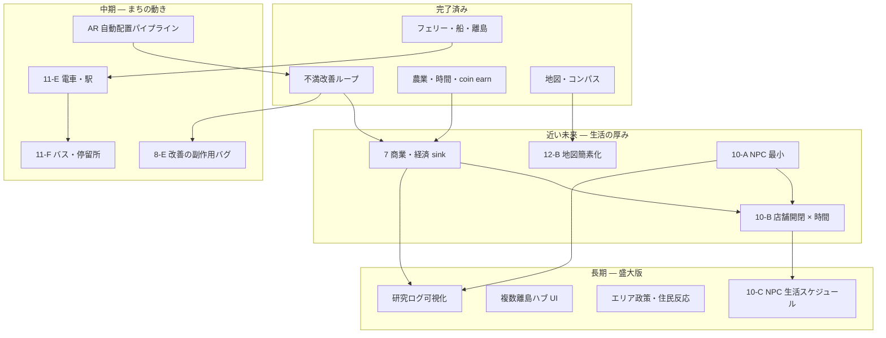

# 今後の実装ロードマップ

> **目的**: 現状（Phase 8–9 + 地図/船）から先、何をどの順で実装するかを一望できるマップ。  
> **方針**: 「まちが育つ → 人が動く → 経済が回る → 交通でつながる → 研究データが溜まる」

---

## 0. いまどこまでできているか

| 領域 | 状態 | 主なファイル |
|------|------|-------------|
| 不満 → 改善 → 島拡張 | ✅ コア完成 | `useGameStore`, `barrierActions` |
| 農業・時間・通貨（earn） | ✅ 完成 | `agriGrowth`, `farmingActions`, `economyData` |
| 海・離島・フェリー・船 | ✅ MVP完成 | `ferryRoutes`, `Avatar` |
| ホバーボード | ✅ 完成 | `hoverboardData`, `Avatar` |
| 地図・コンパス | ✅ 完成（要簡素化） | `WorldMapPanel`, `CompassPanel` |
| 線路（rail） | ⚠️ 見た目のみ | `gridNeighbors` — **電車なし** |
| 商業施設 | ❌ 未着手 | Phase 7 予定 |
| NPC | ❌ 未着手 | — |
| 電車・バス等 | ❌ 未着手 | — |
| AR投稿 → 島配置 | ⚠️ 部分（手動配置） | `ARPostingMode`, `startPlacingQuest` |

---

## 1. 全体マップ（依存関係）



---

## 2. 推奨実装順（優先度付き）

### 🔴 すぐやる（1–2週間）— 体感が大きい・軽い

| ID | 内容 | 理由 |
|----|------|------|
| **12-B** | **地図を簡素化**（島の大きさ + 自分の位置のみ） | 要望どおり。summary 集計を削除 |
| **7-A** | **商業 shape 1種**（`market_stall` 等）+ 配置コスト | coin earn に spend がない。経済ループの穴 |
| **7-C** | **種代・肥料（coin sink）** | 農業と経済の接続。実装コスト小 |
| **8-E-lite** | 改善副作用を**トーストのみ**（既存）→ 新バグ spawn 1パターン | トレードオフ体験の強化 |

### 🟡 次の山（2–4週間）— 「まち」らしくなる

| ID | 内容 | 理由 |
|----|------|------|
| **10-A** | **NPC 最小**（歩行者 2–3体、固定パス or ランダム徘徊） | 空っぽ感の解消。研究の「多様な視点」の演出 |
| **7-B** | **施設効果**（近くの畑 +15% 等） | 商業を置く意味が生まれる |
| **10-B** | **店舗開閉 × worldTime** | 時間軸との接続。NPC の次 |
| **11-E-MVP** | **電車 1編成 + 2駅間往復** | 線路が活きる。フェリーと並ぶ交通軸 |

### 🟢 中期（1–2ヶ月）— 盛大版の土台

| ID | 内容 |
|----|------|
| **11-F** | バス路線 / 停留所（Line 不満と連動） |
| **10-C** | NPC 生活スケジュール（朝市→昼→帰宅） |
| **7-D** | クエスト連動（「収穫10回」「店を3つ」） |
| **K** | AR投稿 → 位置推定 → 島上バグ自動生成（パイプライン） |
| **N** | 複数離島ハブの切替 UI |

### 🔵 長期（研究・教育向け）

| ID | 内容 |
|----|------|
| **O** | エリア政策（Area 不満の集団反応） |
| **P** | 操作ログ・改善プラン選択の研究ダッシュボード |
| **VR** | 投稿地点の VR 再現（別プロジェクト境界） |

---

## 3. フェーズ別 詳細

### Phase 12-B — 地図簡素化（要望反映）

**ゴール**: 島同士の位置関係 + 島の大きさ + プレイヤー位置。それ以外は載せない。

| 表示する | 表示しない |
|----------|------------|
| 本島 / 離島のドット（面積 ∝ chunk 数 or size） | 港・畑・ベンチ・街灯の数 |
| プレイヤー位置（青） | 個別ブロック |
| 船位置（任意・乗船時のみ） | 不満マーカー（将来オプション） |

**実装タスク**:
- [ ] `WorldMapPanel` から `summaries` 集計を削除
- [ ] 島ドット半径を `chunk.size` または所属 chunk 数から算出
- [ ] `mapProjection.js` に投影ロジックを抽出（任意）

---

### Phase 7 — 商業・経済（coin の spend ループ）

**前提**: Phase 6 で harvest → coin は回っている。足りないのは **使い道**。

| サブ | 内容 | 新規 shape / 状態 |
|------|------|-------------------|
| 7-A | 露店・市場 | `market_stall`, `shop_front` |
| 7-B | 施設バフ（半径内 agri bonus） | `placedBlocks[].commercial` |
| 7-C | 種代・肥料 | `plantAgriBlock` に cost チェック |
| 7-D | 経済クエスト | `quests` に type: `economy` |

**ゲームデザイン**:
- 収穫で稼ぐ → 店を置く → 畑が育ちやすくなる → また収穫、の **正のループ**
- バリア改善（公共）と商業（民間）の **役割分担** が見える

**技術メモ**:
- `economyData.js` に `COMMERCIAL_SHAPES`, `PLACEMENT_COST`, `BUFF_RADIUS` を追加
- `finishBuildMode` 前に coin 不足チェック（free build は無料のまま）
- Store 分割: `store/economy/` を Phase 7 前に検討（`useGameStore` が 2100 行超）

---

### Phase 10 — NPC・まちの生活

**ゴール**: 島が「誰かが住んでいる場所」に見える・感じられる。

| サブ | 内容 | 複雑度 |
|------|------|--------|
| 10-A | 歩行者 NPC（見た目 + 簡単移動） | 低 |
| 10-B | 店 `openHours` × `worldTime` | 中 |
| 10-C | スケジュール（家→店→公園→帰宅） | 高 |
| 10-D | 不満コメントと NPC の `demographic` 連動 | 中 |

**10-A MVP 仕様（おすすめ最初の一歩）**:
```
npcs[] = { id, pos, target, speed, model, label }
- 島の walkable タイル上をランダム waypoint
- プレイヤーに近づくと吹き出し（既存 comment テンプレ流用可）
- 物理: Rapier kinematic or 単純 lerp（最初は latter）
```

**ファイル案**:
- `src/components/3d/NpcWalker.jsx`
- `src/constants/npcData.js`
- `useGameStore`: `npcs`, `spawnDefaultNpcs`（島拡張時に +1–2 体）

**研究との接続**:
- NPC は「住民の声」の具現化 → インクルーシブデザインの **視点提示**
- 将来: NPC が特定プラン改善後にルート変更（段差回避など）

---

### Phase 11-E/F — 交通・乗り物（盛大版 OK）

**現状**: フェリー（船）、ホバーボード、泳ぎ。**rail は見た目のみ**。

| 乗り物 | 用途 | 既存資産 |
|--------|------|----------|
| 🚢 フェリー | 本島 ↔ 離島 | ✅ 完成 |
| 🛹 ホバーボード | 島内短距離 | ✅ 完成 |
| 🚃 電車 | 島内 / 将来は駅間 | `rail` mesh, 駅デコ |
| 🚌 バス | Line 不満・迂回路 | `path` と組合せ |
| 🚲 自転車（任意） | 低速・狭路 | 新規 |

**11-E 電車 MVP**:
1. `train_station` shape（既存駅デコと統合可）
2. `rail` 連結グラフ上を 1 編成が loop
3. プレイヤー E で乗降 → カメラ追従（船と同パターン）
4. `transit_link` の代替解として Line 不満に使える

**11-F バス**:
- `bus_stop` + `path` 3 マス以上
- 停車 → 乗車 → 次停留所（フェリーより短距離）

**共通パターン**（`Avatar.jsx` で共通化済みの船/ホバーボードを流用）:
```javascript
ride = { type: 'boat'|'train'|'bus', heading, speed, routeId, segmentIndex }
```

---

### Phase 8-E / 10-O — 改善のトレードオフ（研究向け）

| 内容 | 例 |
|------|-----|
| 副作用バグ spawn | スロープ急 → 車椅子不満 |
| エリア政策 | Area 不満が複数解決で「住民評価」変動 |
| 住民反応トースト | 「この変更で通学路が…」 |

---

### Phase AR — 投稿パイプライン

| 段階 | 内容 |
|------|------|
| 現状 | AR → クエスト → **手動**で島に配置 |
| 次 | AR メタデータ（needType, severity）→ 自動で `bugs[]` に |
| 将来 | 位置 → 離島/本島推定、VR シーン export |

---

## 4. 機能 × フェーズ 一覧表

| 機能 | Phase | 依存 | 工数目安 |
|------|-------|------|----------|
| 地図簡素化 | 12-B | なし | S |
| market_stall + 配置コスト | 7-A | economy | S |
| 種代・肥料 | 7-C | economy | S |
| 施設バフ | 7-B | 7-A, agri | M |
| NPC 徘徊 | 10-A | なし | M |
| 店舗開閉 | 10-B | 7-A, worldTime | M |
| 電車往復 | 11-E | rail graph | L |
| バス | 11-F | path, 11-E | L |
| 副作用バグ | 8-E | barrier | M |
| AR 自動配置 | K | ARPosting | L |
| 研究ログ UI | P | 全般 | L |

S = 数日、M = 1–2週、L = 2–4週

---

## 5. おすすめ「次の3スプリント」

### Sprint 1 — 生活の入口
1. 地図簡素化（12-B）
2. `market_stall` + 配置コスト（7-A）
3. 種代（7-C）

**完了イメージ**: 地図がスッキリ、coin を使う理由ができる。

### Sprint 2 — 人がいるまち
1. NPC 2–3体（10-A）
2. 施設バフ（7-B）
3. 店の開閉時間（10-B）

**完了イメージ**: 歩いている人、時間で変わる店、商業の意味。

### Sprint 3 — 交通でつながる
1. 電車 2駅 loop（11-E）
2. バス 1路線（11-F）
3. Line 不満 × transit の分岐整理

**完了イメージ**: フェリー・電車・バス・ホバーボードの **交通メニュー** が揃う。

---

## 6. 盛大版ビジョン（遠景）

```
[ AR で現地の不満を投稿 ]
        ↓
[ ゲーム内の島に課題として出現 ]
        ↓
[ プレイヤーが改善プランを選び建築 ]
        ↓
[ NPC の動線が変わる / 店が繁盛 / 電車が通る ]
        ↓
[ 島が拡張、離島が増え、交通網が複雑化 ]
        ↓
[ 操作ログ・選択ログが研究データに ]
        ↓
[ VR で他者がその不便を体験 ]
```

**「錬金術」メタファーの完成形**: 不満（lead）→ 改善（gold）→ まちの化学反応（NPC・経済・交通）。

---

## 7. やらない方がよいこと（今）

| 項目 | 理由 |
|------|------|
| 地図に全ブロック表示 | パフォーマンス・UI 複雑化。要望で不要 |
| いきなり 50 体 NPC | 10-A のシンプル版で十分 |
| Store 分割前に Phase 10 全部 | `useGameStore` 破綻リスク |
| 天候システム | Phase 5 で defer。優先度低 |
| インベントリ | Phase 6 で defer |

---

## 8. 関連ドキュメント

| Doc | 内容 |
|-----|------|
| **`15_Store_App_リファクタリング計画.md`** | **useGameStore / App 分割の詳細設計・実行計画** |
| **`14_詰めどころ_チェックリスト.md`** | **完成度評価・ polish 優先度（すぐ参照用）** |
| `09_農業UI・通貨_実装計画_Phase6.md` §9 | Phase 7 商業の元ネタ |
| `10_バリアフリー実装計画_Phase8.md` | 副作用・Area 政策 |
| `11_海・離島・フェリー_実装計画_Phase9.md` | 交通の起点 |
| `12_地図・船操作改善_実装計画.md` | 地図・船（12-B で簡素化） |
| `05_農地・線路_詳細設計.md` | rail 隣接（電車の土台） |

---

*最終更新: 2026-05 — ゼミ進捗・ユーザー要望（地図簡素化・商業・NPC・交通）を反映*
