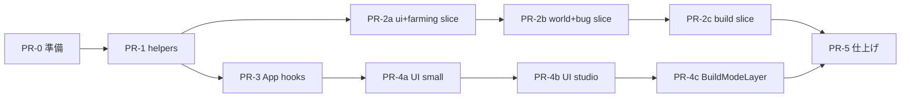

# Store / App リファクタリング — 詳細設計・実行計画書

> **対象**: ① `useGameStore.js` 分割 ＋ ② `App.jsx` 薄型化  
> **方針**: **一気にやるが、PR は段階的**。公開 API（`useGameStore`）は維持し、内部だけ差し替える。  
> **目的**: Phase 7（商業）・Phase 10（NPC）前に、変更の安全網とレビュー可能な単位を作る。

---

## 0. 結論 — 一気にできるか？

**できる。** ただし「1 PR で全部」は NG。

| やり方 | 可否 |
|--------|------|
| 1 PR で store 全分割 + App 全抽出 | ❌ レビュー不能・ロールバック困難 |
| **1 ブランチ / 3〜5 PR に分け、連続マージ** | ✅ 推奨 |
| 公開 `useGameStore()` を残すファサード方式 | ✅ 全コンポーネントの import 一括変更を避ける |

**総工数目安**: 3〜5 日（集中作業） / 1〜2 週（ゼミ並行）

---

## 1. 現状分析

### 1.1 ファイル規模

| ファイル | 行数 | 主な責務 |
|----------|------|----------|
| `src/store/useGameStore.js` | ~2100 | 状態・永続化・島・建築・農業・バグ・DIY 全部 |
| `src/App.jsx` | ~1600 | キーボード・ポインタ・建築 UI 大量・Canvas ルート |
| `src/components/ui/ControlBottomBar.jsx` | ~750 | パレット（Phase 2 以降で触る） |

### 1.2 Store 内のドメイン境界（論理分割）

```
useGameStore
├── persistence     … save/load, normalize, favorites
├── world             … islandChunks, expansion, ferryRoutes, remote hub
├── bugs & quests     … bugs, quests, DIY, finishBuildMode, removeBug
├── build             … placedBlocks, shape/material, placeBlock, undo, area, studio
├── farming & time    … worldTime, agri harvest/plant, economy
└── ui & transport    … viewMode, overlays, mapPos, hoverboard flags, toasts
```

### 1.3 App.jsx 内の塊

```
App.jsx
├── hooks 候補
│   ├── useBuildKeyboardShortcuts   … keydown ~150行
│   └── useBuildPointerPlacement    … handlePointerMove ~120行
├── UI 抽出候補
│   ├── BuildModeGuide              … 右下ガイド + ショートカットボタン
│   ├── BuildMaterialPalette        … 素材 Q-P パレット
│   ├── BuildEditStudioPanel        … isEditingInStudio サイドバー
│   ├── BuildDiagonalStudioPanel    … isDesigningInStudio オーバーレイ
│   ├── BuildSizeAdjustPanel        … isAdjustingSize UI
│   ├── BuildAreaSelectToolbar      … area_select 確定バー
│   └── BuildResolutionBanner       … 不満解決条件・buildFinishError
└── 残すもの
    ├── Canvas / KeyboardControls ラップ
    ├── モード分岐（MainGameScene vs StudioScene）
    └── グローバル Overlay（Quest, AR, BugReport）
```

### 1.4 既に分離済み（触らない）

- `utils/barrierActions.js`, `barrierValidation.js`
- `utils/ferryRoutes.js`, `ferryDockPlacement.js`
- `utils/farmingActions.js`, `agriGrowth.js`
- `constants/buildShortcuts.js`（キー定義は hook から import）

---

## 2. 目標アーキテクチャ

### 2.1 Store — Slice + Facade

```text
src/store/
├── useGameStore.js          … 公開エントリ（create + slice 合成のみ ~80行）
├── slices/
│   ├── persistenceSlice.js  … load/save/subscribe, resetGameData
│   ├── worldSlice.js        … island, expansion, ferry, remote
│   ├── bugSlice.js          … bugs, quests, startDIY, finishBuildMode
│   ├── buildSlice.js        … placement, undo, area, studio, shape
│   ├── farmingSlice.js      … worldTime, economy, harvest/plant
│   └── uiSlice.js           … viewMode, map, toasts, AR flags
└── helpers/
    ├── islandExpansion.js   … createRingExpansionChunks, createExpansionTerrainBlock
    ├── bugFactory.js        … createDefaultBugs, normalizeBug, createExpansionBug
    ├── placedBlockFactory.js… block payload 生成（nature/agri/terrain）
    └── saveSchema.js        … SAVE_KEY, normalize 系
```

**原則:**
- 各 slice は `(set, get) => ({ state, actions })`
- slice 間依存は **get() 経由**（現状と同じ）
- **外部 import は常に `useGameStore` のみ**（段階1では変更しない）

```javascript
// useGameStore.js（完成形イメージ）
import { create } from 'zustand';
import { createPersistenceSlice } from './slices/persistenceSlice';
import { createWorldSlice } from './slices/worldSlice';
// ...

export const useGameStore = create((set, get) => ({
  ...createPersistenceSlice(set, get),
  ...createWorldSlice(set, get),
  ...createBugSlice(set, get),
  ...createBuildSlice(set, get),
  ...createFarmingSlice(set, get),
  ...createUiSlice(set, get),
}));
```

### 2.2 App — 薄いルート + Build サブツリー

```text
src/
├── App.jsx                          … ~250行目標
├── hooks/
│   ├── useBuildKeyboardShortcuts.js
│   └── useBuildPointerPlacement.js
└── components/ui/build/
    ├── BuildModeLayer.jsx           … buildMode 時の UI 束ね
    ├── BuildModeGuide.jsx
    ├── BuildMaterialPalette.jsx
    ├── BuildEditStudioPanel.jsx
    ├── BuildDiagonalStudioPanel.jsx
    ├── BuildSizeAdjustPanel.jsx
    ├── BuildAreaSelectToolbar.jsx
    └── BuildResolutionBanner.jsx
```

```jsx
// App.jsx（完成形イメージ）
export default function App() {
  useBuildKeyboardShortcuts();
  const { handleGroundClick, handlePointerMove, handleGroundDoubleClick } = useBuildPointerPlacement();

  return (
    <KeyboardControls map={keyboardMap}>
      <Canvas>...</Canvas>
      <TopRightPanel />
      <MainBottomNav />
      {buildMode && <BuildModeLayer />}
      {!buildMode && <ExploreOverlays />}
      {isARMode && <ARPostingMode />}
    </KeyboardControls>
  );
}
```

---

## 3. Slice 詳細設計

### 3.1 `persistenceSlice`

| 状態 | 備考 |
|------|------|
| （状態なし） | 副作用のみ |

| Action | 移動元 |
|--------|--------|
| `resetGameData` | useGameStore |
| subscribe → localStorage | useGameStore 末尾 useEffect 相当 |

| Helper ファイル | 内容 |
|----------------|------|
| `saveSchema.js` | `SAVE_KEY`, `loadSave`, `normalizeSave`, `loadFavorites` |

---

### 3.2 `worldSlice`

| 状態 | |
|------|--|
| `islandChunks`, `expandingLevel`, `expansionFocusTarget` | |
| `activeRemoteHubId`, `remoteExpansionLevel`, `remoteIslandGeneration` | |
| `ferryRoutes`, `islandToast`, `avatarResetNonce` | |

| Action | 行数目安 |
|--------|----------|
| `setIslandChunks` | 小 |
| `finishBuildMode` 内の expansion 部分 | **→ `expandWorldAfterSolve(get, set)` に抽出** |

| Helper | |
|--------|--|
| `islandExpansion.js` | `createRingExpansionChunks`, `createExpansionTerrainBlock`, `createRemoteIslandChunk`, `getActiveRemoteHub` |

---

### 3.3 `bugSlice`

| 状態 | |
|------|--|
| `bugs`, `quests`, `activeBug`, `isReturning` | |
| `buildMode`, `buildFinishError` | build と共有 — **buildMode は buildSlice、buildFinishError は bugSlice** |
| `placingQuest`, `isQuestBoardOpen` | |

| Action | |
|--------|--|
| `startDIY`, `finishBuildMode`, `removeBug`, `setBugChosenPlan` | |
| `startPlacingQuest`, `cancelPlacing` | |

**`finishBuildMode` 分割:**

```javascript
// bugSlice.js
finishBuildMode: () => {
  const resolution = evaluateResolutionOrThrow(get);
  markBugSolved(get, set);
  expandWorldAfterSolve(get, set);      // worldSlice helper
  realignFerryDocksAfterExpansion(get); // world helper
  exitBuildMode(get, set);              // build helper
}
```

---

### 3.4 `buildSlice`（最大）

| 状態 | |
|------|--|
| `placedBlocks`, `selectedShape`, `selectedMaterial`, `blockRotation`, `selectedScale` | |
| `hoverPosition`, `gridSnapping`, undo/redo stacks | |
| `area*` , `clipboardBlocks`, studio/diagonal 系全部 | |
| `selectedNature/Agri/Terrain/Hoverboard*` | |

| Action | 移動優先度 |
|--------|------------|
| `placeBlockAtHover` | 高 — **`utils/placement/` へロジック抽出** |
| `setSelectedShape`, `handleUndo/Redo` | 高 |
| `handleArea*`, studio 系 | 中 |

**`placeBlockAtHover` 内部抽出:**

```text
utils/placement/
├── eraseAtPosition.js
├── placeStandardBlock.js
├── placeAreaSelection.js
└── buildBlockPayload.js     … nature/agri/terrain/hoverboard payload
```

buildSlice の action は orchestrator に留める（~30行）。

---

### 3.5 `farmingSlice`

| 状態 | `worldTime`, `pauseTimeInBuildMode`, `farmingProgress`, `economy`, `farmingToast`, `interactionMode` |
| Action | `advanceWorldTimeSeconds`, `harvestAgriBlock`, `plantAgriBlock`, time toggles |

---

### 3.6 `uiSlice`

| 状態 | `viewMode`, `isARMode`, `mapPlayerPos/Boat/Heading`, `interactionHint`, `ferryTransitionUntil`, `goodSpots`, `isGoodSpotBookOpen`, `isHoverboarding`, `currentHoverboardStationId` |
| Action | 各 setter |

---

## 4. App 抽出詳細

### 4.1 `useBuildKeyboardShortcuts`

**責務:** 現 `App.jsx` L85–240 の `useEffect` を丸ごと移動。

**依存:**
- `useGameStore.getState()` / actions
- `buildShortcuts` 定数（形状・素材 map は `constants/buildShortcuts.js` に集約済み → **Digit map も移す**）

**インターフェース:**

```javascript
export function useBuildKeyboardShortcuts({ showBuildShortcutsRef, setShowBuildShortcuts }) {
  useEffect(() => { ... }, []);
}
```

**テスト観点:**
- buildMode 外では無反応
- `?` トグル、オーバーレイ中 Esc
- 斜め/編集スタジオ中のロック

---

### 4.2 `useBuildPointerPlacement`

**責務:** `handleGroundClick`, `handleGroundDoubleClick`, `handlePointerMove`, `setHoveredIdsSafely`

**インターフェース:**

```javascript
export function useBuildPointerPlacement() {
  return {
    handleGroundClick,
    handleGroundDoubleClick,
    handlePointerMove,
  };
}
```

**依存:** terrain snap utils, `useGameStore`

---

### 4.3 `BuildModeLayer`

buildMode 中の UI を1箇所に集約。App から conditional 10個 → 1個に。

```jsx
export function BuildModeLayer() {
  const buildMode = useGameStore(s => s.buildMode);
  if (!buildMode) return null;
  return (
    <>
      <BuildShortcutsOverlay ... />
      <BuildResolutionBanner />
      <BuildModeGuide />
      <ControlBottomBar ... />
      <BuildMaterialPalette />
      <BuildEditStudioPanel />
      <BuildDiagonalStudioPanel />
      <BuildSizeAdjustPanel />
      <BuildAreaSelectToolbar />
    </>
  );
}
```

各 Panel は store を selector 購読（必要な slice だけ）。

---

## 5. 実行計画（PR 分割）

### Phase R0 — 準備（リスクゼロ）

**PR-0: 土台ファイル追加のみ（挙動変更なし）**

- [ ] `store/helpers/islandExpansion.js` — 純関数を **コピー**（useGameStore からはまだ呼ばない）
- [ ] `store/helpers/saveSchema.js`
- [ ] `constants/buildShortcuts.js` に `SHAPE_KEY_MAP`, `MATERIAL_KEY_MAP` 追加
- [ ] 手動テスト checklist を `docs/` に追記

**完了条件:** `npm run build` 成功、ゲーム挙動同一

---

### Phase R1 — Store 純関数抽出

**PR-1: helpers 接続（store 行数 -300 目標）**

- [ ] useGameStore 内の duplicate 純関数を helpers へ **切替**（削除）
- [ ] `utils/placement/buildBlockPayload.js` 抽出（placeBlockAtHover の payload 部分のみ）
- [ ] `finishBuildMode` から `expandWorldAfterSolve()` を helper 化（中身は useGameStore 内関数でも可）

**完了条件:**
- 島拡張・配置・完成が手動テスト通過
- useGameStore ~1800行

---

### Phase R2 — Store Slice 化（核心）

**PR-2a: uiSlice + farmingSlice**

- [ ] 影響小さい slice から切り出し
- [ ] useGameStore は spread 合成

**PR-2b: worldSlice + bugSlice**

- [ ] `finishBuildMode` orchestrator 化
- [ ] ferryRoutes 更新パターンを `syncFerryRoutes(set, get)` に統一

**PR-2c: buildSlice**

- [ ] 最大塊を移動
- [ ] `placeBlockAtHover` → placement utils

**完了条件:**
- useGameStore.js **~100行以下**（compose のみ）
- 全 slice 合計 ~2000行（行数は増えても OK、ファイルは分割）

**ロールバック:** PR-2 は 2a→2b→2c と細かく。問題あれば slice 単位で revert。

---

### Phase R3 — App Hook 抽出

**PR-3: hooks 2本**

- [ ] `useBuildKeyboardShortcuts.js`
- [ ] `useBuildPointerPlacement.js`
- [ ] App.jsx から該当コード削除

**完了条件:** キー・配置の手動テスト全通過、App ~1400行

---

### Phase R4 — App UI 抽出

**PR-4a:** `BuildModeGuide`, `BuildMaterialPalette`, `BuildResolutionBanner`  
**PR-4b:** Studio / Diagonal / SizeAdjust / Area パネル  
**PR-4c:** `BuildModeLayer` 統合、App.jsx **~250行目標**

**完了条件:** 建築モード UI 見た目・操作同一

---

### Phase R5 — 仕上げ（任意）

- [ ] App の `useGameStore()` → selector 化（パフォーマンス）
- [ ] `CameraRig` / `GameCameraPanController` pan 一本化
- [ ] `docs/03_ゲームの仕様.md` 更新

---

## 6. PR 依存関係



**並行可能:**
- PR-2a と PR-3 は R1 完了後なら **並行可**（別ファイル）
- PR-4 は PR-3 後が安全（UI が hooks に依存しないが App がスリム化済みの方が diff が読みやすい）

---

## 7. テスト計画

### 7.1 各 PR 共通スモーク

1. `npm run build`
2. 散歩 → 不満選択 → DIY → 改善 → 完成
3. フリー建築 → 配置 → Undo/Redo
4. 離島出現後フェリー設置 → 船移動
5. 収穫 → coin 増加
6. リロード → セーブ復元
7. 建築中 `?` ショートカット一覧

### 7.2 Store 分割後追加

8. 島拡張 ×2（本島・離島）
9. 斜めブロック設計 → 配置
10. 3D 編集スタジオ → 確定
11. 範囲選択 Shift+S → コピー/移動/削除

### 7.3 自動テスト（今回スコープ外だが将来）

- `evaluateActiveBuildResolution` — 既に pure
- `buildBlockPayload` — 単体テスト向き
- `createRingExpansionChunks` — 単体テスト向き

---

## 8. リスクと対策

| リスク | 対策 |
|--------|------|
| slice 間の循環依存 | helper は pure、slice 間は get() のみ。import 方向を `helpers ← slices ← useGameStore` に固定 |
| 挙動リグレッション | PR 小さく、各 PR でスモーク手動テスト |
| ferryRoutes 更新漏れ | `syncFerryRoutes(set, get)` 1箇所化 |
| ゼミ発表前の不安定 | **R0–R1 だけ先にマージ**（挙動同一・リスク低）し、R2 以降は発表後でも可 |
| import 大量変更 | ファサード維持で **コンポーネント側 import 零** |

---

## 9. やらないこと（スコープ外）

- ControlBottomBar の分割（別 Phase）
- Avatar.jsx 分割
- 新機能（商業・NPC）の同時追加
- TypeScript 化
- 全コンポーネントの selector 化（Phase R5）

---

## 10. 完了定義（Definition of Done）

- [ ] `useGameStore.js` が compose 専用（**100行以下**）
- [ ] slice 6本 + helpers 4本以上
- [ ] `App.jsx` **300行以下**
- [ ] build 関連 UI が `components/ui/build/` に集約
- [ ] キーボード・ポインタが hooks に分離
- [ ] 外部からの store import は `useGameStore` のみ（変更不要）
- [ ] スモークテスト 11 項目通過
- [ ] `docs/14_詰めどころ_チェックリスト.md` の「Store 分割」にチェック

---

## 11. タイムライン例

| 日 | 作業 |
|----|------|
| Day 1 | PR-0 + PR-1（helpers 抽出） |
| Day 2 | PR-2a + PR-2b |
| Day 3 | PR-2c（buildSlice） |
| Day 4 | PR-3 + PR-4a |
| Day 5 | PR-4b + PR-4c + 総合テスト |

ゼミ並行なら **2 週間で PR-0〜R3**、**R4 は後回し** でも Store 分割の主目的は達成。

---

## 12. 関連ドキュメント

- `docs/13_今後の実装ロードマップ.md` — Phase 7 前の Store 分割言及
- `docs/14_詰めどころ_チェックリスト.md` — §4 技術的負債
- `docs/09_農業UI・通貨_実装計画_Phase6.md` §11 — 元々の分割方針

---

*作成: 2026-05 — Store/App 一括リファクタリング計画*
