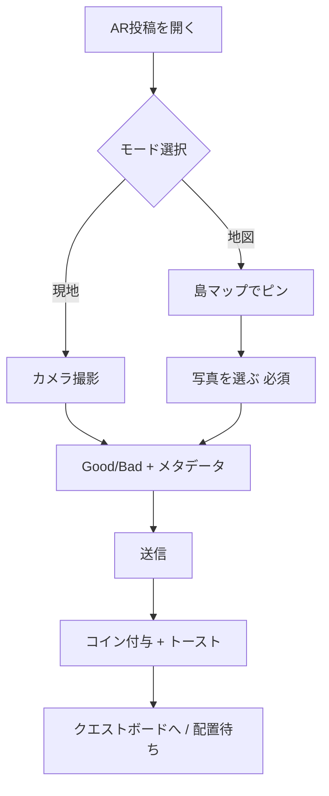

# 投稿2択（現地／地図）＋コイン報酬 — 実装計画

| 項目 | 内容 |
|------|------|
| 対象 | RQ1 入力（`ARPostingMode`）＋ 経済（`economy.coin`） |
| 前提 | 表2確定版のまま。SV・外部地図APIは**スコープ外** |
| 方針 | **本丸＝現地カメラ＋写真**。地図モード＝島マップで位置＋**端末から写真選択（訪問時に撮ったもの）** |
| 成果物 | モード2択 UI、`captureMode` メタデータ、投稿コイン付与、HUDトースト |
| 関連 | `09_農業UI・通貨_Phase6.md`、`14_詰めどころ`、`16_卒論_研究構成メモ` |

---

## 0. エグゼクティブサマリー

| やること | やらないこと |
|----------|----------------|
| 投稿開始で **現地 / 地図** の2択 | Google Street View / Mapillary API |
| 現地＝既存カメラフロー | 写真なしの地図のみ投稿（卒論方針上は後回し） |
| 地図＝ゲーム内 `WorldMapPanel` 相当の2Dマップでピン | 実世界 lat/lng マップ（Phase 2 候補） |
| 地図モードも **写真必須**（ギャラリー選択） | 遠隔＝代理視界の主張 |
| 投稿成功でコイン（現地多め） | モンスター討伐コイン（別計画） |

**API:** 不要（カメラ・`getUserMedia`・`<input type="file">` のみ）

---

## 1. 体験フロー

### 1.1 全体



### 1.2 現地モード（`captureMode: 'onsite'`）

- 現行 `ARPostingMode` のカメラ〜評価シートを**そのまま移管**
- 変更点：最初にモード選択画面を挟むだけ

### 1.3 地図モード（`captureMode: 'map'`）

1. **位置:** 展開可能な島マップ（`WorldMapPanel` の `project` ロジック再利用）をタップで1点選択
2. **写真:** `<input type="file" accept="image/*" capture="environment">` で1枚必須（訪問時撮影を想定。文言で明示）
3. **メタデータ:** 現地と同一ウィザード（Good/Bad、needType 等）
4. **配置:** 既存どおりクエストボード → マップタップ配置。ピン座標は `mapPin: [x, z]` をクエストに保持し、配置時の初期候補に使う（任意・Phase B）

---

## 2. コイン設計

### 2.1 定数（新規 `src/constants/postingEconomy.js`）

```javascript
export const POST_REWARD = {
  onsite: { bad: 8, good: 5 },
  map: { bad: 4, good: 3 },
};

export const POST_REWARD_FIRST_BONUS = 5; // 初回投稿のみ（セッション or 永続）
```

| 投稿 | コイン | 意図 |
|------|--------|------|
| 現地・Bad | 8 | 列C◎の主チャネル |
| 現地・Good | 5 | 良い場所も評価するがやや少なめ |
| 地図・Bad | 4 | 参加入口は広げるが現地より少ない |
| 地図・Good | 3 | 同上 |
| 初回ボーナス | +5 | チュートリアル的きっかけ（1回限り `lifetimePosts` で判定） |

収穫（3〜7コイン/回）と同オーダー。インフレしすぎない。

### 2.2 純関数（新規 `src/utils/postingEconomy.js`）

```javascript
computePostReward({ captureMode, postKind, isFirstPost }) → { coin, toast }
```

- `normalizeEconomy` で加算
- `lifetimeEarned` も加算
- 任意：`stats.totalPosts` を Store に追加（分析・卒論メモ用）

### 2.3 Store アクション

```javascript
awardPostCoins(payload) // computePostReward → set economy + farmingToast
```

`App.jsx` の `onPost` 内で `addGoodSpotPost` / `setQuests` の**後**に呼ぶ。

---

## 3. データモデル

### 3.1 投稿ペイロード（`onPost` に追加）

| フィールド | 型 | 説明 |
|------------|-----|------|
| `captureMode` | `'onsite' \| 'map'` | 必須 |
| `mapPin` | `[number, number]` | 地図モード時のワールド XZ（任意だが推奨） |
| `photo` | string (data URL) | 既存 |
| 既存 | `postKind`, `needType`, … | 変更なし |

### 3.2 クエスト／Good Spot への伝播

- `normalizeBug` / `normalizeGoodSpot` に `captureMode` を透過（`...bug` で可、明示フィールド追加推奨）
- セーブ JSON に含める（既存 `quests` / `goodSpots` 配列）
- **UI:** `QuestBoardOverlay` で小バッジ「現地」「地図」（Phase B・余力）

---

## 4. ファイル変更一覧

| 優先 | ファイル | 変更 |
|:----:|----------|------|
| P0 | `src/constants/postingEconomy.js` | 新規 |
| P0 | `src/utils/postingEconomy.js` | 新規 |
| P0 | `src/store/useGameStore.js` | `awardPostCoins`, `postStats`, セーブ/ロード |
| P0 | `src/components/ui/ARPostingMode.jsx` | モード選択・地図ピン・ファイル写真・リファクタ |
| P0 | `src/App.jsx` | `onPost` でコイン付与 |
| P1 | `src/components/ui/MapPinPicker.jsx` | 新規（マップタップ UI、`WorldMapPanel` から抽出） |
| P1 | `src/components/ui/Overlays.jsx` | クエストカードに `captureMode` 表示（任意） |
| P2 | `docs/16_卒論_研究構成メモ.md` | プロトタイプ方針1段落 |
| P2 | `docs/03_ゲームの仕様.md` | 投稿・経済（あれば） |

**触らない:** `WorldMapPanel.jsx` のゲーム内ミニマップ本体（投稿専用ピッカーを別コンポーネントにして干渉最小）

---

## 5. 実装フェーズ

### Phase A — コインのみ（0.5日）

目的：投稿ループと経済を接続（モード未対応でも動く）。

1. `postingEconomy.js` + `postingEconomy` util
2. `awardPostCoins`（暫定 `captureMode: 'onsite'` 固定）
3. `App.jsx` `onPost` 後に呼ぶ
4. トースト例：`+8コイン（現地投稿）`

**受け入れ:** Bad投稿 → コイン増 → `WalletPanel` 反映

---

### Phase B — 2択 UI（1日）

1. `ARPostingMode` 先頭に `postingPhase: 'choose' | 'capture' | 'form'`
2. **choose:** 2カード「現地で撮る」「地図で記録」
3. **capture（onsite）:** 現行カメラ
4. **capture（map）:** `MapPinPicker` + 写真ファイル必須
5. **form:** 既存ステップ（撮影完了〜送信）
6. `submitPost` に `captureMode`, `mapPin` を付与

**受け入れ:** 両モードでクエストボードに載る。地図モードは写真なしでは送信不可。

---

### Phase C — コイン差分＋初回ボーナス（0.5日）

1. `captureMode` / `postKind` で `POST_REWARD` を切替
2. `postStats.firstPostAwarded` または `lifetimePostCount`
3. トースト文言をモード別に

**受け入れ:** 現地 > 地図 のコイン差が確認できる

---

### Phase D — 磨き（任意・0.5日）

- 地図ピン → 配置時にアバター近くの候補位置をヒント
- クエスト一覧にバッジ
- 初回モード選択に1行ヘルプ（「訪問時に撮った写真を選べます」）

---

## 6. UI ワイヤ（モード選択）

```
┌─────────────────────────────────────┐
│  × 閉じる                           │
│  どこから記録しますか？              │
│  ┌─────────────┐ ┌─────────────┐   │
│  │ 📷 現地      │ │ 🗺 地図      │   │
│  │ いま撮影     │ │ 場所を選び   │   │
│  │             │ │ 写真を追加   │   │
│  └─────────────┘ └─────────────┘   │
│  ※ 記録の質は現地撮影が最も高い      │
└─────────────────────────────────────┘
```

---

## 7. 受け入れ基準（チェックリスト）

- [ ] 投稿開始で現地／地図の2択が出る
- [ ] 現地：カメラ → 既存ウィザード → 送信
- [ ] 地図：マップタップ → 写真1枚必須 → 同一ウィザード → 送信
- [ ] 送信後 `captureMode` がクエスト／Good Spot に残る
- [ ] 現地投稿のコイン > 地図投稿のコイン
- [ ] `WalletPanel` とトーストが更新される
- [ ] リロード後もコイン・投稿が保持される
- [ ] カメラ不可環境でも地図＋ファイル投稿で完走できる

---

## 8. 卒論・表2との対応（1段落）

> プロトタイプでは、空間注釈の主チャネルとして現地撮影を設け、地図上の位置指定と訪問時に取得した写真の添付による補助チャネルを併設した。外発的動機づけとして投稿にコインを付与し、現地投稿を高報酬とすることで、列C（状況・空間の記録）を優先する設計意図を操作面でも示した。

---

## 9. リスクと対策

| リスク | 対策 |
|--------|------|
| `ARPostingMode` が肥大化 | `MapPinPicker` 分離、`postingPhase` で段階表示 |
| data URL がセーブ肥大 | 将来：圧縮 or URLのみ（Phase D） |
| 地図ピンと配置位置のずれ | `mapPin` を配置 UI の初期ズームに使う（D） |
| コインインフレ | 報酬は収穫と同程度、spend は Phase 7 既存計画 |

---

## 10. 実装順序（推奨）

```
Phase A（コイン接続）
  → Phase B（2択 + 地図 + 写真ファイル）
  → Phase C（報酬差分）
  → Phase D（任意 polish）
```

**見積:** コア 2〜2.5 日（連続作業時）

---

## 11. 次のコマンド（実装開始時）

1. `postingEconomy` 定数・util 作成
2. Store `awardPostCoins`
3. `App.jsx` 接続
4. `ARPostingMode` リファクタ + `MapPinPicker`
5. `npm run build` で確認

実装に着手する場合は「Phase A から」と指示すればよい。
