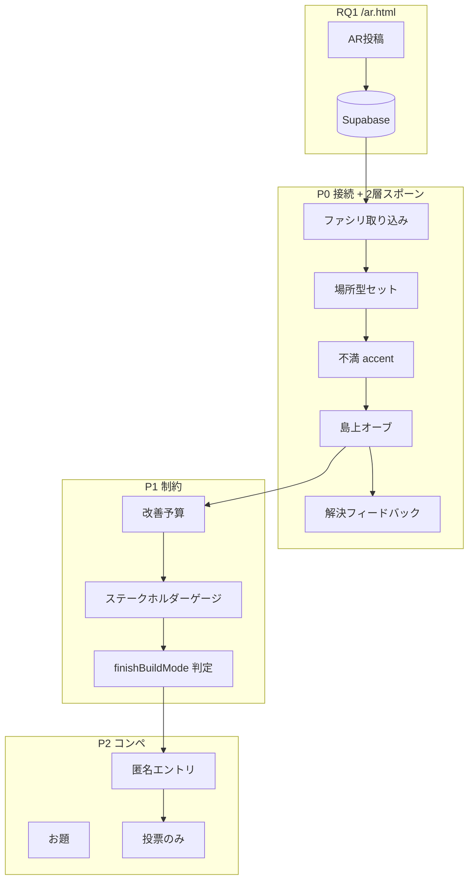

# RQ2 実装計画 — 論文「システム要件」対応版

> **根拠 PDF:** [`docs/論文の整理（課題とRQ、RQの指標設定）.pdf`](./論文の整理（課題とRQ、RQの指標設定）.pdf)（システム要件タブ・RQ2 指標）  
> **関連:** [16_卒論_研究構成メモ](./16_卒論_研究構成メモ.md)、[26_AR投稿ループ閉じ_B](./26_AR投稿ループ閉じ_B_実装計画.md)、[27_バリア_シリアスゲーム機能まとめ](./27_バリア_シリアスゲーム機能まとめ.md)、[28_場所アーキタイプ](./28_場所アーキタイプ_実装計画.md)、[34_AR_いいね](./34_AR_いいね実装計画.md)  
> **更新:** 2026-06 — 2層スポーン（場所型＋不満再現）、reuse 時 accent 追加、案 C 確定

---

## 0. エグゼクティブサマリー

PDF の RQ2 システム要件は **Must 5 項目 + Should 4 項目 + Bridge** と広い。本計画では **全部やらない**。

| 優先 | テーマ | PDF 対応 | 判断 |
|------|--------|----------|------|
| **P0** | RQ1（新 AR）→ RQ2 接続 | Bridge ⑤ マクロ/ミクロ、RQ1 Bridge ⑤⑥ | **最優先で実装** |
| **P0'** | 場所型 + **不満再現**（2層スポーン） | 視点置換・状況理解 | **Phase 1 と一体**（§5） |
| **P1** | パラメータ管理・リソース制約 | RQ2 Must ② | **第2優先。創造性 vs 現実性のトレードオフ** |
| **P2** | 匿名投票（コンペ） | RQ2 Should ③（投票中心） | **第3優先。チャットは任意・後回し可** |
| — | 強制閲覧 | RQ2 Must ① | **現状で十分**（オーブタップ → 写真・ナラティブ → DIY） |
| — | VR 1stPP プロローグ | RQ2 Must ①（VR版） | **スコープ外**（2D + 写真で代替） |
| — | AI ファシリ / デビルズアドボケート | RQ2 Should ④ | **後回し**（人手ファシリで代替） |

**WS データ運用（確定）:** AR 投稿は **事前または当日直前** でよい。リアルタイム同期は不要。ファシリが Supabase から取り込み → ゲーム開始。

**コンペ（確定）:** **投票のみ** で MVP 可。コメント欄は **あってもよいが必須ではない**。

**島上配置（確定方向）:** **案 C** — `placeArchetype` ゾーン半自動 + **§5 の2層スポーン**。柏の葉形状の完全再現は Phase 4 以降。

---

## 1. 論文 RQ2 要件との対応表

### 1.1 Must（譲れない）

| PDF # | 要件 | 現状 | 本計画 |
|-------|------|------|--------|
| ① | ストーリーテリング形式の強制閲覧（写真＋ナラティブを読まないと先に進めない） | 黒オーブタップ → `BugReportOverlay` で comment/photo/affectedGroups 表示 → DIY | **維持**。全画面ブロック型への変更は不要 |
| ② | パラメータ管理・リソース制約の可視化（予算・満足度ゲージ等） | coin earn のみ。建築ほぼ無制限 | **Phase 2 で実装**（改善予算 + ステークホルダー満足度） |

### 1.2 Should（参加の質）

| PDF # | 要件 | 本計画 |
|-------|------|--------|
| ③ | 匿名アイコン + チャット・投票 | **投票のみ MVP**。チャットは Phase 3 オプション |
| ④ | AI ファシリテーター | **実装しない**。WS ファシリが口頭で補う |

### 1.3 Bridge（AR ↔ ゲーム）

| PDF # | 要件 | 本計画 |
|-------|------|--------|
| ⑤ | マクロ（俯瞰マップ）↔ ミクロ（現場1人称）切替 | 島 TPS（マクロ）+ オーブ上の投稿写真（ミクロ）。Phase 1 で Supabase 写真を確実に載せる |
| （RQ1⑥） | affectedGroups タグ | **実装済**（AR 設問）。ゲームオーブに pictogram 表示を Phase 1 で強化 |

### 1.4 VR 要件（PDF page 22）

| 要件 | 本計画 |
|------|--------|
| 他者アバター 1stPP 1.5分 | **VR なし**。ゲーム内写真＋affectedGroups で「疑似ミクロ」 |
| VR 議論空間 | 卒論では **ブラウザ参加型ゲーム** を主装置（doc 16 と整合） |

---

## 2. RQ2 評価指標とログ設計

PDF（page 3, 6–7）の指標に合わせ、実装時に仕込むログ。

### 2.1 指標 1 — 認識的 injustice の無効化

| 測定 | ログ / 手法 |
|------|-------------|
| 他者文脈の理解・自分ごと化 | WS 前後アンケート / インタビュー（**人手**） |
| システム側プロキシ | オーブ閲覧時間、写真パネル展開、plan 選択までの時間、plan 変更回数 |

### 2.2 指標 2 — フラットな議論（構造）

| 測定 | ログ / 手法 |
|------|-------------|
| 少数派意見の議題化 | `affectedGroups` 付き quest の閲覧率 |
| 匿名投票 | コンペ投票数・分布（**Phase 3**） |

### 2.3 指標 3 — 合意形成の質（トレードオフ統合）

| 測定 | ログ / 手法 |
|------|-------------|
| 納得解・妥協案 | 予算内完成率、選択 plan 分布、副作用 spawn 後の追加行動 |
| システム | `improvementBudget` 残量、stakeholder ゲージ変化（**Phase 2**） |

---

## 3. 実装の三本柱



---

## 4. 島上配置 — 案 C（placeArchetype ゾーン半自動）

### 4.1 方針（確定）

doc 28 に沿い、**柏の葉の実景複製ではなく帰納的な場所原型** を島上に置く。

| 案 | 内容 | 判断 |
|----|------|------|
| **A. 完全手動** | 取り込み後ダブルクリック配置 | Phase 1 の fallback のみ |
| **B. 柏の葉型島** | GPS ↔ 島座標、キャンパス形状 | **Phase 4 以降** |
| **C. ゾーン半自動（採用）** | `placeArchetype` → 島上ゾーン → §5 の2層スポーン | **Phase 1 主ルート** |

**座標ルール:**

```
placeArchetype → 島上ゾーン中心 (x, z)
  → spawnQuestOnIsland（§5）
worldPin (lat/lng) → quest メタデータとして保持（エクスポート・論文用）
```

---

## 5. 島上スポーン：場所型 × 不満再現（2層）

doc 28 の **「セットは器、オーブは声」** を、**不満再現を quest 単位** で明示する。

### 5.1 2層の定義

| 層 | データ | 役割 | 島上での出方 |
|----|--------|------|--------------|
| **L1 場所型（器）** | `placeArchetype` | 駅・公園・道路など空間骨格 | `PRESET_TEMPLATES[*].base`（layout + 歩道等） |
| **L2 不満再現** | `needType` | 困りの型に合わせた演出 | `accents[needType]` ブロック + `resolvePlaceNeedStyle(needType)` |

**L1 と L2 は独立。** 場所型は「どこで」、不満再現は「どんな困りか」を担う。

### 5.2 スポーンルール（確定）

| 条件 | L1 場所型 | L2 不満再現 | オーブ |
|------|-----------|-------------|--------|
| **その archetype が初出** | **NEW**（base 一式） | **NEW**（accents + layout needType スタイル） | NEW |
| **同 archetype の2件目以降** | **追加しない**（reuseSite） | **NEW**（当該 quest の accent のみ） | NEW |
| `placeArchetype === 'none'` | なし | accent のみ（またはオーブのみ） | NEW |

**例（駅 `station`）:**

```
1件目: 駅・段差(P)  → 駅骨格 + 段差 half + オーブ
2件目: 駅・暗い(V)  → 骨格なし + 照明 accent + オーブ（同じ駅サイト周辺）
3件目: 駅・段差(P)  → 骨格なし + 段差 accent + オーブ
```

→ **駅セットは1つ。不満の「見える化」は投稿ごとに増える。**

### 5.3 現状コードとの差分

| 項目 | 現状 | Phase 1 で直す |
|------|------|----------------|
| 初出スポーン | base + accents + needType スタイル | **維持**（`createPresetForQuestPlacement`） |
| reuseSite 時 | **blocks 追加なし**（オーブのみ） | **`createDissatisfactionAccentOnly(quest)` を追加** |
| accent の quest 紐づけ | 初回は `presetSourceQuestId` あり | reuse 時も **quest ごとに付与** |
| 解決後 | 演出 accent は消える、構造(P/L)は残る | **維持**（`placeNeedTypeStyle.js`） |

**触るファイル:**

- `src/store/helpers/questLifecycle.js` — `spawnQuestOnIslandState`
- `src/utils/placePresets.js` — accent 抽出関数の分離
- `src/constants/placePresetTemplates.js` — accent 定義（必要に応じ拡充）

### 5.4 accent 配置

reuse 時は既存サイトアンカー（`findExistingSiteAnchor`）を基準に:

- オーブと同様、**同一サイト内の未使用オフセット** に accent ブロックを配置
- 同一 quest の accent は `presetSourceQuestId` で解決時に個別に戻す

### 5.5 プレイヤー体験（目標）

```
AR 投稿（placeArchetype + needType + 写真 + コメント）
  → 取り込み
  → 歩くと「駅まわり」が見える（初出のみ）
  → 目の前に段差・暗さ等の **不満再現** + 黒オーブ
  → タップで写真・ナラティブ → プラン選択 → DIY
  → 解決すると **その quest の演出 accent** が改善される（構造系は残る場合あり）
```

---

## 6. フェーズ別実装計画

### Phase 0 — 前提（ほぼ完了）

- [x] RQ1: `/ar.html` 独立 AR アプリ + Supabase 同期
- [x] RQ2: 不満タップ → プラン選択 → DIY → 島拡張
- [x] `ingestQuestPost` / `sourceQuestId` / 解決トースト（骨格）
- [x] L1+L2 初出スポーン（`createPresetForQuestPlacement`）
- [ ] reuse 時 L2 accent のみ追加（§5.3）
- [ ] WS 15 分デモシナリオ（§8）

---

### Phase 1 — P0: RQ1 → RQ2 接続 + 2層スポーン（2–3 週）

**目的:** 事前 AR 投稿を WS 当日のゲームに載せ、**場所型と不満再現を分けて** 島上に出す。

| ID | 内容 | 成果物 |
|----|------|--------|
| 1-A | ゲームに **Supabase 取り込み UI**（ファシリ向け） | `annotationToGameExport` → `ingestQuestPost` |
| 1-B | **自動スポーン**（案 C ゾーン + `spawnQuestOnIsland`） | 手動 `placingQuest` は fallback |
| 1-C | オーブ UI：**写真・comment・affectedGroups pictogram** | `BugReportOverlay` 強化 |
| 1-D | **解決ループ**（questStatus, トースト, postStats） | doc 26 Phase B |
| 1-E | JSON export **オフライン fallback** | AR 図鑑 → ゲーム import |
| **1-F** | **reuse 時 L2 accent のみ追加** | §5.3。`createDissatisfactionAccentOnly` |

**やらない:** ゲーム内 AR 再投稿、リアルタイム push、実世界 GPS 島マップ。

**PR 分割:**

1. `feat/game-import-ar-supabase`
2. `feat/quest-two-layer-spawn`（1-B + 1-F）
3. `feat/quest-resolve-loop`
4. `feat/bug-overlay-rq1-context`

---

### Phase 2 — P1: パラメータ管理・リソース制約（2 週）

**目的:** 「無理なまちづくり」ではなく **制約内の創造性** を体験させる（PDF RQ2 Must ②）。

| ID | 内容 | 詳細 |
|----|------|------|
| 2-A | **改善予算（improvementBudget）** | quest/bug ごと。coin とは別ゲージ |
| 2-B | **ステークホルダー満足度** | affectedGroups 連動 |
| 2-C | **プラン別制約** | `allowedPlans` + shape 上限 |
| 2-D | **ダッシュボード HUD** | 予算・満足度ゲージ |
| 2-E | **トレードオフ 1 件** | doc 10 Phase 8-E |
| 2-F | **研究ログ** | planId, 予算残, sessionId |

---

### Phase 3 — P2: 匿名コンペ（投票中心）（1.5–2 週）

| ID | 内容 | MVP 仕様 |
|----|------|----------|
| 3-A | **お題（CompetitionTopic）** | ファシリ 1 件設定 |
| 3-B | **エントリ** | DIY 完成物の匿名 snapshot |
| 3-C | **投票** | 1 人 1 票。ランキング表示 |
| 3-D | コメント（任意） | 短文可。**なくても成立** |
| 3-E | AR いいね（doc 34） | RQ1 側。コンペとは別系統 |

---

### Phase 4 — 任意・後回し

| 項目 | 理由 |
|------|------|
| 柏の葉形状の島（§4 案 B） | 工数大。ゾーンラベルで代替可 |
| マクロ/ミクロ UI 切替アニメ | オーブ写真で当面足りる |
| AI デビルズアドボケート | ファシリ口頭 |
| VR 1stPP プロローグ | 別研究境界 |
| 常時匿名チャット | コンペ期間中スレッドで十分 |

---

## 7. PDF に載っているが「今回やらない」一覧

- VR 必須の 1stPP 追体験 → 2D 写真 + pictogram + **L2 不満再現ブロック**
- AI ファシリテーター → 対面 WS + ファシリ
- 全画面強制モーダル → オーブタップ閲覧
- ゲーム内 AR 再投稿
- 環境負荷ゲージの厳密シミュレーション → v1 は予算 + 満足度

---

## 8. WS 運用シナリオ（15 分デモ案）

```
【事前〜直前】
  ライト層: /ar.html で Bad 2–3 件（placeArchetype + needType + 写真 + コメント）
  ファシリ: Supabase 確認

【0–3 分】
  ファシリ: 「クラウドから取り込み」
  → 場所型セット（初出）+ 不満 accent + オーブが島上に出現

【3–8 分】
  参加者: オーブタップ → 写真・ナラティブ・pictogram
  → 目の前の段差/暗さ等（L2）も見える → プラン選択

【8–13 分】
  改善予算内 DIY → 完成 → 解決トースト（該当 quest の accent が改善）

【13–15 分】
  （任意）コンペ投票 / 口頭 debrief / 事後アンケート
```

---

## 9. それ以外に RQ2 として必要なもの

| # | 項目 | フェーズ |
|---|------|----------|
| 1 | 研究ログ / CSV エクスポート | Phase 2-F |
| 2 | 初回チュートリアル（オーブ＝誰かの声、L2＝困りの見た目） | Phase 1 |
| 3 | WS デモ固定データ（3 quest・複数 needType） | Phase 1 |
| 4 | Good 投稿 | 図鑑のみ |
| 5 | 事後アンケート（PDF 指標 1–3） | 研究設計 |

---

## 10. タイムライン（目安）

| 週 | 内容 |
|----|------|
| 1–2 | Phase 1-A,B,F（取り込み + 2層スポーン） |
| 2–3 | Phase 1-C,D,E（オーブ UI + ループ + fallback） |
| 3–4 | Phase 2-A〜D |
| 4–5 | Phase 2-E,F + チュートリアル |
| 5–6 | Phase 3 + doc 34 いいね |

---

## 11. 次のアクション

1. **Phase 1-F 実装:** `createDissatisfactionAccentOnly` + reuse 分岐
2. **Phase 1-A:** ファシリ取り込み UI・重複防止
3. **デモ quest 3 件:** 同一 placeArchetype + 異 needType で reuse accent を見せる
4. **Phase 2 数値:** 改善予算・満足度増減表

---

## 参照ファイル（実装時）

| 領域 | パス |
|------|------|
| AR エクスポート | `src/ar/utils/normalizeAnnotation.js` → `annotationToGameExport` |
| ゲーム取り込み | `src/store/slices/bugSlice.js` → `ingestQuestPost` |
| 2層スポーン | `src/store/helpers/questLifecycle.js` → `spawnQuestOnIslandState` |
| 場所型 + accent | `src/utils/placePresets.js`, `src/constants/placePresetTemplates.js` |
| needType 演出 | `src/utils/placeNeedTypeStyle.js` |
| ループ閉じ | `docs/26_AR投稿ループ閉じ_B_実装計画.md` |
| 場所型設計 | `docs/28_場所アーキタイプ_実装計画.md` |

---

*作成: 2026-06 — 論文 PDF・2層スポーン（L1 場所型 / L2 不満再現）・案 C 確定に基づく。*
