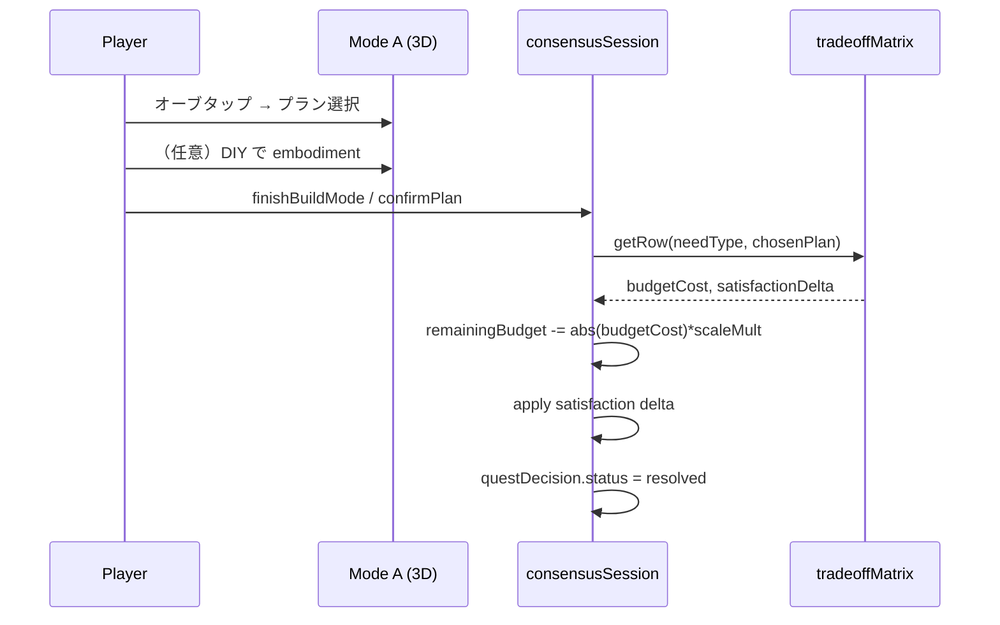

# RQ2 合意形成改修 — 詳細設計書

> **根拠:** [`docs/ゲームの仕様変更部分.pdf`](./ゲームの仕様変更部分.pdf)  
> **現状整理:** [`docs/37_実装機能一覧_ARとゲーム.md`](./37_実装機能一覧_ARとゲーム.md)  
> **関連:** [36_RQ2_実装計画_論文要件対応.md](./36_RQ2_実装計画_論文要件対応.md)  
> **更新:** 2026-06 — PDF 要件に基づく詳細設計（実装前）

---

## 0. エグゼクティブサマリー

### 0.1 コンセプト転換

| 項目 | 現状（実装済） | 改修後（PDF 要件） |
|------|----------------|-------------------|
| ゲームモデル | 不満を **1 件ずつ** 解決 → 島拡張する **成長型** | 限られた **全体予算** の中で **複数不満を同時に** 扱う **配分型** |
| 予算 | Bug ごと `buildSession.budgetLimit`（24/36/48） | **セッション共有** `totalSessionBudget` |
| 満足度 | Bug DIY セッション内の 5 属性 | **島全体** 4 属性ゲージ（初期 50%） |
| 解決コスト | ブロック配置コストのみ | **トレードオフマトリクス**（プラン選択）＋ブロックコスト |
| スポーン | 取り込み/解決のたびに逐次 | WS 開始時 **一斉スポーン** |
| 島拡張 | 解決ごとにリング/離島 | **Serious モード中は停止** |
| コンペ | 個別 DIY の block snapshot | **島全体プラン**（予算残・4 満足度付き） |
| UI | 建築中 HUD に予算・満足度 | **ミクロ（3D）** と **マクロ（議会ダッシュボード）** の分離 |

### 0.2 論文 RQ2 との対応

改修後、システムは PDF が意図する以下を満たす：

1. **共感（ミクロ）** — オーブ → AR 写真・ナラティブ → 現場 DIY（Mode A）
2. **客観的ルール（マクロ）** — 全体予算・4 満足度・クリア条件（Mode B）
3. **フラットな議論** — 匿名コンペで **数値ベース** の案比較（誰が言ったかではなく結果で）

---

## 1. 現状とのギャップ分析

### 1.1 削除・置換対象

| 現行 | ファイル | 改修方針 |
|------|----------|----------|
| `IMPROVEMENT_BUDGET_BY_SCALE`（Bug 個別上限） | `improvementConstraints.js` | **廃止**（Serious モード時） |
| `buildSession.budgetLimit` / per-bug 満足度 | `improvementSession.js` | **Session 共有状態へ移行** |
| `ImprovementHudPanel`（建築中常時表示） | `ImprovementHudPanel.jsx` | **Mode A では非表示**、Mode B に集約 |
| 解決時 `computeWorldExpansionAfterSolve` | `bugSlice.js` | Serious モード中 **スキップ** |
| `transit_link` / フェリー航路プラン | `barrierData.js` | **`mobility_support` に再定義**（Fantasy 要素の整理） |
| コンペ `blockSnapshot`（Bug 単位） | `competitionSlice.js` | **島全体 snapshot** に拡張 |
| 5 属性（視覚・子ども 等） | `improvementConstraints.js` | **4 属性** に再編（PDF 準拠） |

### 1.2 維持・拡張対象

| 現行 | 改修方針 |
|------|----------|
| AR → ゲーム取り込み | 維持。WS 開始時 **batch spawn** API を追加 |
| 2 層スポーン（L1/L2） | 維持 |
| BugReportOverlay（写真・ナラティブ） | 維持。Mode A の共感入口 |
| ブロック配置コスト | **共有予算**から減算するよう変更 |
| `postStats` / 研究ログ | 拡張（sessionBudget, islandSatisfaction 等） |
| プラン別 shape 検証 | 維持（DIY は Mode A で継続） |

---

## 2. コア・データモデル（Zustand）

### 2.1 新規状態 `consensusSession`

Serious / WS モード専用のセッション状態。通常探索モードとは独立。

```typescript
// 概念型（実装は JS）
type ConsensusSession = {
  sessionId: string;
  isActive: boolean;                    // Serious モード ON
  phase: 'planning' | 'building' | 'submitted' | 'closed';

  // --- マクロ・リソース ---
  totalSessionBudget: number;           // 初期算出値
  remainingSessionBudget: number;       // 残量（block cost + plan cost の減算後）
  budgetInitialFormula: string;         // ログ用: "sumMaxPlanCost * 0.75"

  // --- 島全体満足度（4 属性）---
  islandSatisfaction: {
    general: number;      // 一般・若者  0-100
    wheelchair: number;   // 車椅子・身体障害
    senior: number;       // 高齢者
    childcare: number;    // 子育て・ベビーカー
  };

  // --- Quest 単位の決定 ---
  questDecisions: Record<questId, QuestDecision>;

  startedAt: number;
  submittedAt: number | null;
};

type QuestDecision = {
  questId: string;
  bugId: string;
  status: 'pending' | 'in_progress' | 'resolved' | 'ignored';
  chosenPlan: PlanId | 'ignore' | null;
  planMatrixCostApplied: number;        // マトリクス適用済みコスト（絶対値）
  blockCostSpent: number;               // 当該 Quest DIY 中のブロックコスト合計
  scale: 'point' | 'line' | 'area';
  needType: string;                     // P,V,I,...
  satisfactionDeltaApplied: boolean;    // マトリクス delta 適用済みか
};
```

**永続化:** `consensusSession` は WS 中のみ。コンペ提出 snapshot に含める。通常 `urban-alchemist-save-v8` には **phase=submitted 以降の summary のみ** 保存（要検討）。

### 2.2 既存状態との関係

| 既存 | Serious モード時 |
|------|------------------|
| `buildMode` / `buildSession` | 維持するが `budgetLimit` は使わない。`blockCost` は `remainingSessionBudget` から減算 |
| `economy.coin` | 変更なし（Serious 中は UI 非表示） |
| `competition` | `IslandPlanEntry` 型に拡張 |
| `expandingLevel` | 常に 0（拡張しない） |

### 2.3 フラグ `isSeriousMode`

```javascript
// initialState.js
isSeriousMode: false,
consensusSession: null,
uiMode: 'explore' | 'micro' | 'macro',  // 探索 / 現場 / 議会
```

| `isSeriousMode` | 動作 |
|-----------------|------|
| `false` | **現行どおり**（レガシー。個別予算・島拡張・フリー建築可） |
| `true` | 本設計の合意形成フロー |

WS 開始: ファシリが「合意形成セッション開始」→ `isSeriousMode=true` + batch spawn + budget 初期化。

---

## 3. 全体予算（totalSessionBudget）

### 3.1 算出式（PDF 確定）

```
totalSessionBudget = floor( Σ( quest ∈ activeQuests ) maxPlanCost(quest) × 0.75 )
```

- **`maxPlanCost(quest)`** — 当該 quest の needType × scale に対するマトリクス行の **予算コスト最大値**（絶対値。`ignore` は 0）
- **0.75 倍** — 全 quest を最高コストプランで解決しても **25% 不足** → 妥協・無視を強制

### 3.2 算出タイミング

1. `startConsensusSession({ questIds })` 呼び出し
2. 対象 quest が島上に spawn 済みであること
3. `computeSessionBudget(activeQuests)` を pure function で実行
4. `remainingSessionBudget = totalSessionBudget`

### 3.3 消費ルール

| イベント | 減算 |
|----------|------|
| DIY 中のブロック配置 | `BLOCK_IMPROVEMENT_COST[shape]`（既存テーブル流用） |
| DIY 中のブロック削除（Undo） | **返金**（配置コストを加算） |
| Quest **プラン確定**（`resolveQuestDecision`） | マトリクス `budgetCost × scaleMultiplier` |
| Quest **無視確定**（`ignore`） | マトリクス `ignore` 行（コスト 0、満足度ペナルティのみ） |

**オーバーバジェット:**

- 配置時: 残予算不足なら **配置拒否**（現行と同様 toast）
- プラン確定時: 残予算不足なら **確定拒否**
- マクロ画面で「予算超過」警告

### 3.4 実装ファイル

| ファイル | 責務 |
|----------|------|
| `src/constants/tradeoffMatrix.js` | **新規** — needType × plan のマスタ |
| `src/utils/consensusBudget.js` | **新規** — 初期予算算出、消費、返金 |
| `src/store/slices/consensusSlice.js` | **新規** — session CRUD、quest decision |
| `src/store/slices/bugSlice.js` | `finishBuildMode` から expansion 分岐、マトリクス適用 |
| `src/store/slices/buildSlice.js` | 共有予算から block cost 減算 |

---

## 4. ステークホルダー満足度（4 属性）

### 4.1 属性定義（PDF 準拠）

| key | UI ラベル | AR `affectedGroups` からのマッピング |
|-----|-----------|--------------------------------------|
| `general` | 一般・若者 | みんな、（デフォルト） |
| `wheelchair` | 車椅子・身体障害 | 車いす |
| `senior` | 高齢者 | 高齢者 |
| `childcare` | 子育て・ベビーカー | 子ども、ベビーカー |

**廃止（Serious モード）:** 現行 5 属性の `視覚` / `子ども` 単独 — PDF 4 分類に統合。

### 4.2 初期値・クリア条件

| 項目 | 値 |
|------|-----|
| 初期値（全属性） | **50%** |
| クリア（コンペ提出可）条件 1 | **全 active quest** が `resolved` または `ignored` |
| クリア条件 2 | **全属性 ≥ 20%** |

```javascript
export const MIN_ISLAND_SATISFACTION = 20;
export const INITIAL_ISLAND_SATISFACTION = 50;
```

### 4.3 変動タイミング

**プラン確定時（マトリクス適用）** が主。ブロック配置時の微調整ペナルティ（slope 等）は **オプション**（Phase 2 以降。PDF 主眼はプラン選択）。

```
islandSatisfaction[key] = clamp(
  islandSatisfaction[key] + matrixDelta[key] × scaleMultiplier,
  0, 100
)
```

`scaleMultiplier`: point=1.0, line=2.0, area=3.0

---

## 5. トレードオフ・マトリクス（ルールエンジン）

### 5.1 解決プラン（7 + ignore）

| planId | UI 表示名 | 役割 | 備考 |
|--------|-----------|------|------|
| `hard_fix` | 段差を解消する | ハード整備 | slope, 舗装 |
| `detour_path` | 迂回ルートを作る | 動線変更 | 歩道, 案内 |
| `sign_info` | 案内で誘導する | ソフト（情報） | 看板 |
| `lighting` | 照明を増やす | 環境（光） | 街灯 |
| `maintenance` | 維持しやすい空間に | 環境（美化） | ベンチ, 舗装 |
| `care_point` | 見守り拠点をつくる | 人的・社会的 | ベンチ+街灯 |
| `mobility_support` | 移動支援を導入する | モビリティ | **旧 transit_link 置換** |
| `ignore` | 無視する（何もしない） | 放置 | 予算 0、満足度大ペナルティ |

**`transit_link` / フェリー / 離島:** Serious モードでは **allowedPlans から除外**。`mobility_support` はバス停型ブロック等で表現（新 shape または既存 preset accent）。

### 5.2 マトリクスデータ構造

```javascript
// src/constants/tradeoffMatrix.js
export const TRADEOFF_MATRIX = {
  P: {
    hard_fix:      { budget: -8,  general: +2,  wheelchair: +15, senior: +5,  childcare: +10 },
    detour_path:   { budget: -3,  general: +5,  wheelchair: -5,  senior: -2,  childcare: 0   },
    sign_info:     { budget: -1,  general: 0,   wheelchair: -15, senior: -5,  childcare: -5  },
    ignore:        { budget: 0,   general: -5,  wheelchair: -20, senior: -10, childcare: -10 },
    // lighting, maintenance, care_point は P では off または sign_info 同系
  },
  L: { mobility_support: {...}, detour_path: {...}, sign_info: {...}, ignore: {...} },
  I: { sign_info: {...}, maintenance: {...}, ignore: {...} },
  R: { care_point: {...}, maintenance: {...}, sign_info: {...}, ignore: {...} },
  M: { maintenance: {...}, hard_fix: {...}, sign_info: {...}, ignore: {...} },
  V: { care_point: {...}, lighting: {...}, sign_info: {...}, ignore: {...} },
  S: { care_point: {...}, lighting: {...}, sign_info: {...}, ignore: {...} },
  C: { mobility_support: {...}, care_point: {...}, sign_info: {...}, ignore: {...} },
};
```

**完全な数値** — PDF p.10–15 の表をそのまま `tradeoffMatrix.js` に転記（実装時）。

### 5.3 allowedPlans の再定義

needType ごとにマトリクスに **存在する plan のみ** UI に表示。

```javascript
export function getAllowedPlansForQuest({ needType, scale }) {
  const row = TRADEOFF_MATRIX[needType] ?? TRADEOFF_MATRIX.P;
  return Object.keys(row).filter((plan) => plan !== 'ignore');
}
```

`BugReportOverlay` / plan カードは **PDF の 4 択構造**（根本/妥協/ごまかし/無視）を明示:

| コスト帯 | 例（P） |
|----------|---------|
| 高 | hard_fix |
| 中 | detour_path |
| 低 | sign_info |
| 放置 | ignore |

### 5.4 プラン確定フロー



**`ignore` の場合:** DIY スキップ可。BugReportOverlay に「この声を無視する」ボタン → 即マトリクス `ignore` 行適用。

### 5.5 DIY との関係

| プラン | DIY 要件（Mode A） |
|--------|-------------------|
| hard_fix, detour_path, ... | 現行 `evaluateBugResolution` **維持**（shape 条件） |
| ignore | **DIY 不要** |
| mobility_support | 新条件: `bus_stop` 関連 shape または preset（要 shape 定義） |

DIY 未達のまま「確定」は **不可**（現行と同様）。ignore のみ例外。

---

## 6. スポーン・セッションライフサイクル

### 6.1 WS 開始シーケンス

```
1. ファシリ: AR 取り込み（既存 importArAnnotations）
2. ファシリ: 「合意形成セッション開始」
   → startConsensusSession()
3. 未 spawn quest を一括 spawnQuestOnIsland（silent batch）
4. totalSessionBudget 算出
5. islandSatisfaction 初期化（各 50）
6. isSeriousMode = true, uiMode = 'macro'（最初は議会で状況説明）
7. 参加者: 島上に複数オーブ＋煙/パーティクル
```

### 6.2 島拡張の停止

```javascript
// bugSlice.finishBuildMode 内
if (get().isSeriousMode) {
  // computeWorldExpansionAfterSolve を呼ばない
  // expandingLevel を更新しない
}
```

レガシーモード（`!isSeriousMode`）では現行動作を維持。

### 6.3 Batch spawn API

```javascript
// consensusSlice.js
spawnAllQuestsForSession: (questIds?) => {
  const ids = questIds ?? getActivePendingQuestIds();
  for (const id of ids) get().spawnQuestOnIsland(id, { silent: true });
}
```

---

## 7. UI/UX 設計 — ミクロ / マクロ分離

### 7.1 Mode 一覧

| uiMode | 名称 | 画面 | 3D | 主目的 |
|--------|------|------|-----|--------|
| `explore` | 探索 | 通常 HUD | 表示 | レガシー / 移動 |
| `micro` | 現場 | 3D フルスクリーン | **表示** | 共感・DIY（速い思考） |
| `macro` | 議会 | ダッシュボード | **停止 or 非表示** | 予算・満足度・一覧（遅い思考） |

### 7.2 Mode A — 現場（ミクロ）

**変更点（現行から）:**

- `ImprovementHudPanel` **非表示**（予算・満足度を出さない）
- ジョイスティック（矢印）+ 建築パレット + 解決バナーのみ
- オーブタップ → 既存 `BugReportOverlay`（写真全画面 — 維持）

**新規 UI:**

- 画面隅に小さな **「議会へ」** ボタン → `uiMode = 'macro'`

### 7.3 Mode B — 議会（マクロ）

**新規コンポーネント:** `ConsensusDashboardOverlay.jsx`

```
┌─────────────────────────────────────┐
│  残り予算 ████████░░  342 / 1000    │
├─────────────────────────────────────┤
│  一般 ████████░░ 52%                │
│  車椅子 ██████░░░░ 41%              │
│  高齢者 ███████░░░ 48%              │
│  子育て ████████░░ 55%              │
├─────────────────────────────────────┤
│  Quest 一覧（明細）                  │
│  □ 駅前段差(P) — hard_fix — -8     │
│  □ 夜道(V) — pending               │
│  □ ベンチ不足(R) — ignored         │
├─────────────────────────────────────┤
│  [現場へ戻る]  [コンペに提出]        │
└─────────────────────────────────────┘
```

- 3D Canvas は `visibility:hidden` または `frameloop="never"` で GPU 負荷軽減
- 提出ボタン: クリア条件満たすまで disabled + 理由表示

### 7.4 UX ループ（PDF 意図）

```
現場でスロープ配置 → 議会で「車椅子↑ 予算↓」確認
→ 現場に戻ってスロープ削除 / 別 quest を ignore
→ 議会で再確認 → … → 提出
```

---

## 8. 合意形成コンペ（拡張設計）

### 8.1 エントリデータ（現行からの変更）

```typescript
type IslandPlanEntry = {
  id: string;
  voterLabel: string;              // "匿名案 A"
  submittedAt: number;

  // マクロ結果
  remainingSessionBudget: number;
  totalSessionBudget: number;
  islandSatisfaction: { general, wheelchair, senior, childcare };

  // ミクロ結果
  questDecisions: QuestDecision[];  // 各 quest の plan / ignore

  // 再現用（任意・v1 は軽量）
  placedBlocksSnapshot?: BlockSnapshot[];  // 差分のみでも可
  sessionSeed?: string;              // 同じ初期状態からの再現 ID
};
```

### 8.2 提出フロー

```
submitIslandPlan()
  → validateClearConditions()
  → buildIslandPlanEntry(getState())
  → competition.entries.push(entry)
  → consensusSession.phase = 'submitted'
  → toast + 議会 UI で「提出済み」
```

### 8.3 比較 UI（CompetitionPanel 拡張）

| 列 | 内容 |
|----|------|
| 案 | 匿名ラベル |
| 残予算 | remaining / total |
| 一般 / 車椅子 / 高齢 / 子育て | 4 数値 |
| 処理済 quest | resolved N / ignored M |
| 投票 | 既存 1 人 1 票 |

**将来（Supabase）:** `island_plan_entries` テーブル。v1 は localStorage + 同一端末複数 voter でも可（WS 投影用）。

### 8.4 WS 同期フロー（PDF）

1. **個人ワーク（非同期）** — 各自同じ初期 seed（同 quest セット + 同 budget）からプレイ → 提出
2. **議論・比較（同期）** — ファシリ投影で一覧比較
3. **合意** — 投票 + 口頭 debrief（システム外）

---

## 9. Serious モード — 機能ロック

### 9.1 ロック対象

| 機能 | 現行 UI | Serious 中 |
|------|---------|------------|
| フリー建築 | MainBottomNav | **非表示** |
| 農業（種まき・収穫） | TopRightPanel | **非表示** |
| 世界時間速度変更 | WorldTimePanel | **非表示**（昼夜は固定 or 緩慢のみ） |
| ホバーボード | WorldProximityHints | **無効** |
| 島データリセット | TopRightPanel | ファシリ PIN or 非表示 |
| 島拡張 | finishBuildMode | **無効** |

### 9.2 実装パターン

```javascript
// App.jsx / TopRightPanel.jsx
{!isSeriousMode && <FarmingStatusPanel />}
{!isSeriousMode && <AgriInteractionPanel />}

// MainBottomNav.jsx
{!isSeriousMode && <FreeBuildButton />}
{isSeriousMode && <MacroModeToggleButton />}
```

---

## 10. 研究ログ拡張

### 10.1 新イベント種別

| kind | タイミング | フィールド |
|------|------------|------------|
| `session_start` | WS 開始 | totalSessionBudget, questCount |
| `plan_commit` | プラン確定 | questId, plan, budgetCost, satisfactionAfter |
| `quest_ignore` | 無視 | questId, satisfactionAfter |
| `session_submit` | コンペ提出 | remainingBudget, islandSatisfaction |

### 10.2 CSV 列追加

`remainingSessionBudget`, `sat_general`, `sat_wheelchair`, `sat_senior`, `sat_childcare`, `isSeriousMode`

---

## 11. 実装フェーズ

### Phase 1 — 予算・スポーン（トレードオフ発生の最小セット）

| # | タスク | ファイル |
|---|--------|----------|
| 1-1 | `tradeoffMatrix.js` 作成（P, L, I の 3 型から） | 新規 |
| 1-2 | `consensusBudget.js` — 初期予算算出 | 新規 |
| 1-3 | `consensusSlice.js` — session 状態 | 新規 |
| 1-4 | `isSeriousMode` + `startConsensusSession` | initialState, gameStoreState |
| 1-5 | 共有予算から block cost 減算 | buildSlice, bugSlice |
| 1-6 | Bug 個別 budget 廃止（Serious 時） | improvementSession.js |
| 1-7 | batch spawn + WS 開始 UI | ResearchToolsPanel or FacilitatorPanel |
| 1-8 | 島拡張スキップ | bugSlice.finishBuildMode |

**Phase 1 完了条件:** 複数 quest 同時 spawn → 1 quest を豪華にすると別 quest の予算が足りなくなる。

### Phase 2 — 全体満足度・マトリクス適用

| # | タスク | ファイル |
|---|--------|----------|
| 2-1 | マトリクス全 needType（P〜C）転記 | tradeoffMatrix.js |
| 2-2 | 4 属性 satisfaction 管理 | consensusSlice |
| 2-3 | プラン確定 / ignore で delta 適用 | bugSlice, BugReportOverlay |
| 2-4 | `mobility_support` 追加、transit_link Serious  off | barrierData.js |
| 2-5 | クリア条件バリデーション | consensusBudget.js |
| 2-6 | `ConsensusDashboardOverlay`（Mode B） | 新規 UI |
| 2-7 | Mode A から HUD 除去、切替ボタン | BuildModeLayer, App |

**Phase 2 完了条件:** 議会画面で 4 ゲージ + 予算 + quest 明細がリアルタイム更新。

### Phase 3 — コンペ・提出・比較

| # | タスク | ファイル |
|---|--------|----------|
| 3-1 | `IslandPlanEntry` 型 | competitionData.js |
| 3-2 | `submitIslandPlan` | consensusSlice + competitionSlice |
| 3-3 | CompetitionPanel マクロ比較列 | CompetitionPanel.jsx |
| 3-4 | Serious モード UI ロック一式 | App, TopRightPanel, MainBottomNav |
| 3-5 | 研究ログ拡張 | questLifecycle, exportResearchLog |
| 3-6 | （任意）Supabase 提出 sync | 新 migration |

**Phase 3 完了条件:** WS デモ通し（取り込み → 合意形成 → 提出 → 投票 → CSV）。

---

## 12. テスト計画

| テスト | 内容 |
|--------|------|
| `consensusBudget.test.js` | 予算算出 0.75、消費・返金 |
| `tradeoffMatrix.test.js` | needType × plan 行取得、scale 倍率 |
| `consensusClear.test.js` | 全 quest 処理 + 満足度 20 未満で提出不可 |
| `consensusFlow.test.js` | spawn batch → resolve → ignore → submit |
| 回帰 | `!isSeriousMode` で現行 quest flow が壊れない |

---

## 13. 未決定事項・要確認

| # | 論点 | 提案（デフォルト） |
|---|------|-------------------|
| 1 | レガシーモードを残すか | **残す**（`isSeriousMode` フラグ）。卒論 WS は Serious のみ |
| 2 | DIY 必須 vs プラン選択のみ | **DIY 必須**（ignore 除く）。 embodiment は論文の「共感」 |
| 3 | block cost と matrix cost の二重減算 | **両方**（PDF p.2 block + p.6 matrix）。調整は playtest で |
| 4 | `mobility_support` の DIY shape | v1 は `bus_stop_layout` + path で代用 |
| 5 | 同一端末複数参加者 | v1 は voterId 分離で OK。真の BYOD は Supabase 提出 |
| 6 | 初期 quest セット | デモ 3 件 + 取り込み quest を session 開始時に固定 |
| 7 | doc 36 との関係 | 本設計は **Phase 5（合意形成改修）** として doc 36 に追記 |

---

## 14. doc 36 との位置づけ

```
Phase 0–3（doc 36）  … 接続・2層スポーン・個別予算・コンペ MVP ✅ 実装済
Phase 4（doc 36）     … 柏の葉島等（任意）
Phase 5（本設計）     … 合意形成・トレードオフ・マクロ/ミクロ ★ これから
```

---

## 15. 参照

| ドキュメント | 内容 |
|--------------|------|
| [ゲームの仕様変更部分.pdf](./ゲームの仕様変更部分.pdf) | 要件・マトリクス原表 |
| [37_実装機能一覧_ARとゲーム.md](./37_実装機能一覧_ARとゲーム.md) | 現行実装 |
| [36_RQ2_実装計画_論文要件対応.md](./36_RQ2_実装計画_論文要件対応.md) | 旧 Phase 計画 |

---

*作成: 2026-06 — `docs/ゲームの仕様変更部分.pdf` に基づく詳細設計。実装 PR 時に本ドキュメントを更新すること。*
